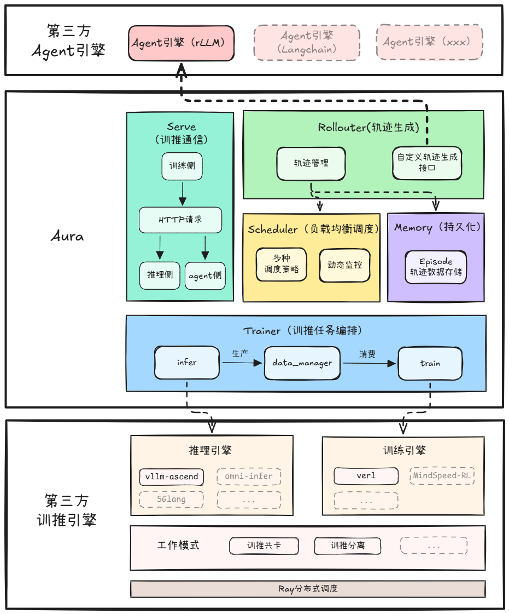

<h1 align="center">Aura: 面向 AI Agent 训推调一体化框架</h1>

[![Zread](https://img.shields.io/badge/Zread-Ask_AI-_.svg?style=flat&color=0052D9&labelColor=000000&logo=data%3Aimage%2Fsvg%2Bxml%3Bbase64%2CPHN2ZyB3aWR0aD0iMTYiIGhlaWdodD0iMTYiIHZpZXdCb3g9IjAgMCAxNiAxNiIgZmlsbD0ibm9uZSIgeG1sbnM9Imh0dHA6Ly93d3cudzMub3JnLzIwMDAvc3ZnIj4KPHBhdGggZD0iTTQuOTYxNTYgMS42MDAxSDIuMjQxNTZDMS44ODgxIDEuNjAwMSAxLjYwMTU2IDEuODg2NjQgMS42MDE1NiAyLjI0MDFWNC45NjAxQzEuNjAxNTYgNS4zMTM1NiAxLjg4ODEgNS42MDAxIDIuMjQxNTYgNS42MDAxSDQuOTYxNTZDNS4zMTUwMiA1LjYwMDEgNS42MDE1NiA1LjMxMzU2IDUuNjAxNTYgNC45NjAxVjIuMjQwMUM1LjYwMTU2IDEuODg2NjQgNS4zMTUwMiAxLjYwMDEgNC45NjE1NiAxLjYwMDFaIiBmaWxsPSIjZmZmIi8%2BCjxwYXRoIGQ9Ik00Ljk2MTU2IDEwLjM5OTlIMi4yNDE1NkMxLjg4ODEgMTAuMzk5OSAxLjYwMTU2IDEwLjY4NjQgMS42MDE1NiAxMS4wMzk5VjEzLjc1OTlDMS42MDE1NiAxNC4xMTM0IDEuODg4MSAxNC4zOTk5IDIuMjQxNTYgMTQuMzk5OUg0Ljk2MTU2QzUuMzE1MDIgMTQuMzk5OSA1LjYwMTU2IDE0LjExMzQgNS42MDE1NiAxMy43NTk5VjExLjAzOTlDNS42MDE1NiAxMC42ODY0IDUuMzE1MDIgMTAuMzk5OSA0Ljk2MTU2IDEwLjM5OTlaIiBmaWxsPSIjZmZmIi8%2BCjxwYXRoIGQ9Ik0xMy43NTg0IDEuNjAwMUgxMS4wMzg0QzEwLjY4NSAxLjYwMDEgMTAuMzk4NCAxLjg4NjY0IDEwLjM5ODQgMi4yNDAxVjQuOTYwMUMxMC4zOTg0IDUuMzEzNTYgMTAuNjg1IDUuNjAwMSAxMS4wMzg0IDUuNjAwMUgxMy43NTg0QzE0LjExMTkgNS42MDAxIDE0LjM5ODQgNS4zMTM1NiAxNC4zOTg0IDQuOTYwMVYyLjI0MDFDMTQuMzk4NCAxLjg4NjY0IDE0LjExMTkgMS42MDAxIDEzLjc1ODQgMS42MDAxWiIgZmlsbD0iI2ZmZiIvPgo8cGF0aCBkPSJNNCAxMkwxMiA0TDQgMTJaIiBmaWxsPSIjZmZmIi8%2BCjxwYXRoIGQ9Ik00IDEyTDEyIDQiIHN0cm9rZT0iI2ZmZiIgc3Ryb2tlLXdpZHRoPSIxLjUiIHN0cm9rZS1saW5lY2FwPSJyb3VuZCIvPgo8L3N2Zz4K&logoColor=ffffff)](https://zread.ai/Ascend/AgentSDK)
[![DeepWiki](https://img.shields.io/badge/DeepWiki-Ask_AI-_.svg?style=flat&color=0052D9&labelColor=000000&logo=data:image/png;base64,iVBORw0KGgoAAAANSUhEUgAAACwAAAAyCAYAAAAnWDnqAAAAAXNSR0IArs4c6QAAA05JREFUaEPtmUtyEzEQhtWTQyQLHNak2AB7ZnyXZMEjXMGeK/AIi+QuHrMnbChYY7MIh8g01fJoopFb0uhhEqqcbWTp06/uv1saEDv4O3n3dV60RfP947Mm9/SQc0ICFQgzfc4CYZoTPAswgSJCCUJUnAAoRHOAUOcATwbmVLWdGoH//PB8mnKqScAhsD0kYP3j/Yt5LPQe2KvcXmGvRHcDnpxfL2zOYJ1mFwrryWTz0advv1Ut4CJgf5uhDuDj5eUcAUoahrdY/56ebRWeraTjMt/00Sh3UDtjgHtQNHwcRGOC98BJEAEymycmYcWwOprTgcB6VZ5JK5TAJ+fXGLBm3FDAmn6oPPjR4rKCAoJCal2eAiQp2x0vxTPB3ALO2CRkwmDy5WohzBDwSEFKRwPbknEggCPB/imwrycgxX2NzoMCHhPkDwqYMr9tRcP5qNrMZHkVnOjRMWwLCcr8ohBVb1OMjxLwGCvjTikrsBOiA6fNyCrm8V1rP93iVPpwaE+gO0SsWmPiXB+jikdf6SizrT5qKasx5j8ABbHpFTx+vFXp9EnYQmLx02h1QTTrl6eDqxLnGjporxl3NL3agEvXdT0WmEost648sQOYAeJS9Q7bfUVoMGnjo4AZdUMQku50McDcMWcBPvr0SzbTAFDfvJqwLzgxwATnCgnp4wDl6Aa+Ax283gghmj+vj7feE2KBBRMW3FzOpLOADl0Isb5587h/U4gGvkt5v60Z1VLG8BhYjbzRwyQZemwAd6cCR5/XFWLYZRIMpX39AR0tjaGGiGzLVyhse5C9RKC6ai42ppWPKiBagOvaYk8lO7DajerabOZP46Lby5wKjw1HCRx7p9sVMOWGzb/vA1hwiWc6jm3MvQDTogQkiqIhJV0nBQBTU+3okKCFDy9WwferkHjtxib7t3xIUQtHxnIwtx4mpg26/HfwVNVDb4oI9RHmx5WGelRVlrtiw43zboCLaxv46AZeB3IlTkwouebTr1y2NjSpHz68WNFjHvupy3q8TFn3Hos2IAk4Ju5dCo8B3wP7VPr/FGaKiG+T+v+TQqIrOqMTL1VdWV1DdmcbO8KXBz6esmYWYKPwDL5b5FA1a0hwapHiom0r/cKaoqr+27/XcrS5UwSMbQAAAABJRU5ErkJggg==)](https://deepwiki.com/Ascend/AgentSDK)

# ✨ 最新消息

- [2026.7.8]: 🚀 新增支持 Qwen3-14B模型，并提供[快速拉起指南](../docs/zh/aura/models/qwen3-14b_quick_start/qwen3-14b-hybrid.md)
- [2026.06.12]: 🚀 新增支持 Qwen3-4B, Qwen3-8B, Qwen3-32B, Qwen3-30B-A3B 模型，并提供[快速拉起指南](../docs/zh/aura/models)
- [2026.04.25]: 🚀 发布 AgentSDK 全新训推调框架 **Aura** ，支持训推共卡与训推分离模式

# ℹ️ 简介

**Aura(Agentic Ultra-fast Reinforcement Architecture)** 是一个面向基础模型的训推调一体化框架，能够基于任务轨迹和奖励信号持续优化基础模型，通过强化学习等优化方法，使模型通过后训练，逐步具备规划、工具使用和长程决策等 Agent 化能力。

**Aura** 通过统一抽象接口兼容多种训练引擎、推理引擎与 Agent 框架，支持用户灵活接入自定义模型与工具链，帮助开发者快速构建、训练与部署自己的 Agent。

# ⚙️ 功能介绍

- 支持[训推共卡](../docs/zh/aura/04_user_guide/02_hybrid.md)和[训推分离](../docs/zh/aura/04_user_guide/03_one_step_off.md)模式。
- 支持[混合批次调度](../docs/zh/aura/04_user_guide/mixed_batch.md)（实验特性）。
- 支持[自定义 agent 接入](../docs/zh/aura/04_user_guide/04_custom_agent.md)。
- 支持[Qwen3-4B](../docs/zh/aura/models/qwen3-4b.md)、[Qwen3-8B](../docs/zh/aura/models/qwen3_8b.md)、[Qwen3-14B](../docs/zh/aura/models/qwen3-14b_quick_start/qwen3-14b-hybrid.md)、[Qwen3-32B](../docs/zh/aura/models/qwen3_32b.md)、[Qwen3-30B-A3B](../docs/zh/aura/models/qwen3-30b-a3b.md)模型。
- 支持 verl 训练引擎，vllm 推理引擎。
- 支持 rLLM agent 引擎。
- 使用 tensorboard 记录训练指标。
- 硬件支持： Ascend A2/A3 架构服务器。

# 🚀 快速入门

| 训练框架                 | 训练模型      | 训练场景 | 服务器架构 | 推荐最小算力资源     | 快速入门指南                                                                                      |
|----------------------|-----------|------|-------|--------------|---------------------------------------------------------------------------------------------|
| verl+vllm+fsdp2+训推共卡 | Qwen3-4B  | Math | A3    | 单机 4*64GB 显存 | [Qwen3-4B 共卡模式快速拉起指南](../docs/zh/aura/models/qwen3-4b_quick_start/qwen3-4b-hybrid.md)       |
| verl+vllm+fsdp2+训推分离 | Qwen3-4B  | Math | A3    | 双机 4*64GB 显存 | [Qwen3-4B 分离模式快速拉起指南](../docs/zh/aura/models/qwen3-4b_quick_start/qwen3-4b-one-step-off.md) |
| verl+vllm+fsdp2+训推共卡 | Qwen3-14B | Math | A2    | 单机 8*64GB 显存 | [Qwen3-14B 共卡模式快速拉起指南](../docs/zh/aura/models/qwen3-14b_quick_start/qwen3-14b-hybrid.md)    |

- 如果想了解模型通用的完整快速入门流程，请参考：[快速入门指南](../docs/zh/aura/03_quick_start.md)。

# 📦 安装指南

当前 Aura 仅提供环境部署流程，包含容器环境部署，准备模型权重和训练数据。

**前置依赖**：Python、Docker（用于容器环境部署）

**Python 依赖**：[requirements.txt](requirements.txt)，包含 Aura 核心框架运行所需的基础依赖（如 torch、transformers、ray 等）。

**第三方依赖**：[third_party/requirements_with_verl_vllm.txt](third_party/requirements_with_verl_vllm.txt)，包含 megatron、mindspeed、rllm 等第三方仓库依赖。

详细步骤请遵循[安装指南](../docs/zh/aura/02_installation_guide.md)。

# 📖 使用指南

**前置知识**：建议在使用 Aura 前了解以下依赖框架：

- [vllm-ascend](https://docs.vllm.ai/projects/vllm-ascend-cn/zh-cn/latest/)：vLLM 在昇腾 NPU 上的推理后端
- [verl](https://verl.org.cn/en/latest/index.html)：强化学习训练框架

**使用指南**：

- 训推分离模式（资源充足）：请参考[训推分离使用指南](../docs/zh/aura/04_user_guide/03_one_step_off.md)。
- 训推共卡模式（资源受限）：请参考[训推共卡使用指南](../docs/zh/aura/04_user_guide/02_hybrid.md)。
- 混合批次调度（实验特性）：请参考[混合批次调度使用指南](../docs/zh/aura/04_user_guide/mixed_batch.md)。
- 定义 Agent 内容、接入自有数据与工具链：请参考[自定义 Agent 接入指南](../docs/zh/aura/04_user_guide/04_custom_agent.md)。

# ❓ FAQ

FAQ 包含环境部署或运行过程中可能需要的报错及解决方案，相关 FAQ 请参考：[FAQ](../docs/zh/aura/07_faq.md)。

# 🛠️ 贡献指南

- 贡献前，请先签署[开放项目贡献者许可协议（CLA）](https://clasign.osinfra.cn/sign/gitee_ascend-1611222220829317930)。
- 如果您遇到 bug，请提交[issue](https://gitcode.com/Ascend/AgentSDK/issues)。
- 如果您计划贡献 bug-fixes，请提交 Pull Requests，参见[具体要求](../contributing.md)。
- 如果您计划贡献新特性、功能，请先创建 issue 与我们讨论。写明需求背景/目的，如何设计，对现有 API 等的影响。未经讨论提交 PR 可能会导致请求被拒绝，因为项目演进方向可能与您的想法存在偏差。
- 更详细的贡献流程，请参考[贡献指南](../contributing.md)。

# ⚖️ 相关说明

🔹 《[版本说明](../docs/zh/aura/08_release_notes.md)》 
🔹 《[许可证声明](../LICENSE.md)》 
🔹 《[文档许可证声明](../docs/LICENSE)》 
🔹 《[免责声明](../docs/zh/aura/09_disclaimer.md)》 
🔹 《[安全声明](../docs/zh/aura/06_security_hardening.md)》 
🔹 《[附录](../docs/zh/aura/10_appendix.md)》 

# 🤝 建议与交流

欢迎大家为社区做贡献。如果有任何疑问或建议，请提交[issue](https://gitcode.com/Ascend/AgentSDK/issues)，我们会尽快回复。感谢您的支持。

# 🙏 致谢

Aura 由华为公司的以下部门联合贡献：

- 昇腾应用使能开发部
- 2012 系统工程实验室
- 华为全球技术服务部-AI 计算实验室

感谢来自社区的每一个 PR，欢迎贡献 Aura!
