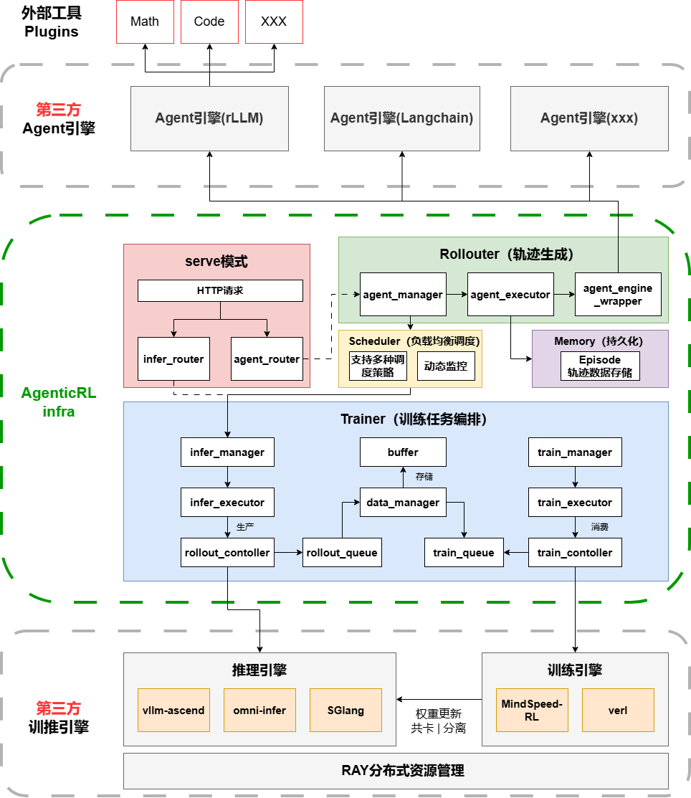

# 简介

Agent SDK用来帮助用户快速训练AI智能体。

- 多种轨迹生成方法，支持插件。
- 融合调度高效利用显存。

**使用导引**

如果第一次使用本软件，可以从[快速入门](quick_start.md#快速入门)中的样例开始上手，并确保按照其中步骤准备好相关环境和软件包。

如果对于相关流程已比较熟悉，可以直接跳转到[Python接口说明](api_python.md#python接口说明)获取需要的函数接口，加速数据处理流程。

# 软件架构

Agent SDK软件架构如[图1](#fig173917397815)所示。

**图 1**  Agent SDK软件架构

**表 1**  架构图模块介绍

|模块|说明|
|--|--|
|**外部工具 Plugins**|外部工具插件，如Math、Code等，Agent可调用的外部能力|
|**第三方 Agent 引擎**|支持多种Agent引擎，包括rLLM、Langchain等|
|**Serve 模式**|服务化部署模式，提供HTTP API接口，包含infer_router和agent_router|
|**Rollouter (轨迹生成)**|负责Agent轨迹生成，包含agent_manager、agent_executor、agent_engine_wrapper|
|**Scheduler**|推理请求调度器，支持PD分离和负载均衡|
|**Memory**|轨迹数据持久化存储，使用Episode格式|
|**Trainer (训练任务编排)**|训练任务管理和编排，包含buffer和data_manager|
|**infer_manager / infer_executor**|推理服务管理和执行|
|**rollout_controller**|轨迹生成控制器，协调推理和数据流动|
|**train_manager / train_executor**|训练服务管理和执行|
|**train_controller**|训练控制器，协调训练和数据流动|
|**推理引擎**|支持多种推理引擎，包括vllm-ascend、omni-infer、SGLang|
|**训练引擎**|支持多种训练引擎，包括MindSpeed-RL、verl|
|**RAY 分布式资源管理**|基于Ray的分布式资源管理，支持共卡/分离部署|

# 支持特性

## 训推共卡

支持训练（Train）与推理（Inference）任务在同一组 NPU/GPU 资源上协同运行，实现训推资源共享与动态调度。系统能够根据训练阶段与推理阶段的负载情况，对显存、计算资源及调度队列进行统一管理，从而提升整体资源利用率。

在训推共卡模式下：

- 训练任务与推理任务部署在同一张卡或同一组卡上
- 推理阶段可直接复用训练阶段已加载的模型权重，减少模型重复加载与参数同步开销
- 支持训练与推理之间的显存动态释放与复用，降低整体显存占用
- 能够减少跨节点通信与数据搬运开销，提升推理吞吐效率
- 适用于中小规模集群、资源受限环境以及需要高资源利用率的强化学习训练场景

## 训推分离

支持训练（Train）与推理（Inference）任务分离部署，训练任务运行于训练集群，推理任务运行于独立的推理集群，实现训练与推理的解耦。当前项目支持 **one-step off-policy** 模式。

在训推分离模式下：

- 训练节点专注于模型更新与梯度计算
- 推理节点专注于样本生成（rollout）
- 支持独立扩缩容训练与推理资源
- 支持多训练节点共享推理服务
- 支持大规模推理并发生成场景

### one-step off-policy 模式

#### 背景

在传统强化学习训练流程中，推理（rollout 采样）与训练（模型更新）通常采用串行执行方式：

1. 先执行推理生成完整样本
2. 等待所有样本生成结束
3. 再执行训练更新模型

在**共卡模式**下，推理采用同步阻塞方式执行，训练必须等待推理当前的 batch 完成后才能开始更新，这种方式存在明显的**长尾问题（Tail Latency Problem）**：

- 模型更新必须等待最慢的样本生成完成
- 在长序列生成过程中，训练侧 NPU 长时间空闲
- 推理长尾越严重，整体训练吞吐下降越明显
- 导致计算资源利用率较低

#### 运行过程

**one-step off-policy（单步异步策略）** 是一种异步强化学习训练模式，其核心思想是：推理与训练并行执行，训练阶段始终使用"上一阶段推理生成"的样本进行更新，从而降低推理长尾导致的资源空闲问题，同时尽可能保持策略一致性。

在该模式下，训练与推理不会严格同步阻塞，而是通过"延迟一步"的方式形成流水线：

- **第一轮**
  - 推理与训练初始权重均为 W₁
  - 推理使用 W₁ 生成轨迹数据 T₁
  - 此时训练尚未开始
- **第二轮**
  - 推理继续使用 W₁ 生成轨迹数据 T₂
  - 训练使用上一轮生成的 T₁ 进行训练，训练完成后权重更新为 W₂
  - 当前轮结束后，将 W₂ 同步到推理侧
- **第三轮**
  - 推理使用最新同步的 W₂ 生成轨迹数据 T₃
  - 训练使用上一轮生成的 T₂ 进行训练，训练完成后权重更新为 W₃
  - 当前轮结束后，将 W₃ 同步到推理侧
- **后续轮次以此类推**，形成通用模式（n ≥ 2）：`Infer(Wₙ₋₁) → Tₙ`，`Train(Tₙ₋₁) → Wₙ`

> 由于训练阶段始终使用"滞后一步"的推理策略生成的数据进行训练（例如第三轮训练使用的 T₂ 是由 W₁ 而非当前 W₂ 生成的），因此该机制被称为 **one-step off-policy** 模式。

#### 核心特点

为解决共卡模式的长尾问题，one-step off-policy 采用**分离模式**：推理与训练独立部署并异步运行，通过队列传递数据。训练端消费的是"已经生成完成并进入队列"的样本，而不是当前正在生成的样本，因此推理与训练可以形成真正的流水线并行。

整个过程中，推理与训练始终并行运行：

- 推理负责持续生成新轨迹
- 训练负责消费上一阶段生成的数据进行模型更新
- 两者通过队列异步解耦，而不是串行等待

这种机制能够有效减少：

- 推理长尾导致的训练等待
- NPU 空闲时间
- 训练与推理之间的同步阻塞

从而显著提升整体训练吞吐与资源利用率。
