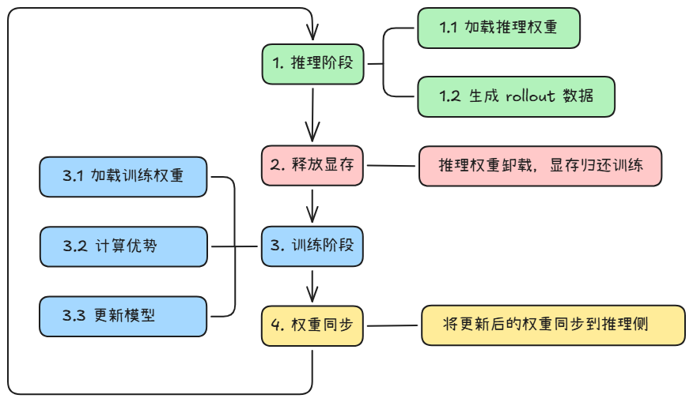

# 训推共卡使用指南（On-Policy 策略）<a name="ZH-CN_TOPIC_HYBRID_GUIDE"></a>

## 简介

训推共卡（Hybrid 模式）是 AgentSDK 提供的一种资源部署模式，支持训练与推理任务在同一组 NPU/GPU 上协同运行。该模式通过显存时分复用机制，使训练和推理交替使用同一组卡的显存资源，适用于中小规模集群或资源受限场景。

共卡模式天然是一种 On-Policy 训练策略：推理使用当前最新策略生成数据，训练立即消费这些数据来更新策略，然后下一轮推理再使用更新后的策略生成新数据。整个过程“生成→训练→生成”在同一策略版本内紧密闭环，不存在策略滞后。

### 模式与策略

AgentSDK 的训推共卡采用两层设计：

- 部署模式：指训练和推理的资源部署方式，目前支持训推共卡和训推分离。
- 训练策略：指在共卡模式下，训练如何利用推理产生的数据的同步策略。共卡模式天然采用 On-Policy 策略：推理使用当前最新策略生成数据，训练立即消费这些数据来更新策略，然后下一轮推理再使用更新后的策略生成新数据。整个过程“生成→训练→生成”在同一策略版本内紧密闭环，不存在策略滞后。

因此，当配置文件中将 work_mode 设置为 hybrid 时，表示同时选择了“共卡部署模式”和“On-Policy 同步训练策略”。

### 运行过程

共卡模式下，训练和推理在每个迭代中交替执行：



- 推理阶段完成后，系统自动释放推理占用的显存，供训练使用
- 训练阶段完成后，系统自动将更新后的权重同步给推理引擎
- 整个过程自动管理，无需手动干预

### 适用场景

- 集群卡数有限，无法分别部署训练和推理集群
- 希望减少跨节点通信和数据搬运开销
- 希望推理直接复用训练已加载的模型权重，避免重复加载

> [!TIP] 提示
> 如果集群资源充足，且希望训练与推理并行执行以提升吞吐，可参考[训推分离模式使用指南](one_step_off.md)。分离模式采用 Off-Policy 策略（One-Step-Off），训练使用上一轮策略产生的轨迹数据。

## 使用方法

### 步骤 1：修改 hosts.conf

文件路径：`configs/hosts.conf`

共卡模式支持单机和多机部署，核心是每个节点上训练和推理共享同一组卡。

**单机共卡部署**时，只需配置一行，并将 `train_master_index` 和 `infer_master_index` 均设为 1：

```shell
# host,index,train_master_index,infer_master_index(可选)
192.168.0.1,0,1,1
```

| 参数 | 说明 |
|------|------|
| host | 节点 IP 地址 |
| index | 节点索引，从 0 开始 |
| train_master_index | 训练主节点索引，设为 1 表示该节点启动训练 |
| infer_master_index | 推理主节点索引，设为 1 表示该节点启动推理。**共卡模式必须配置此参数，且与 train_master_index 相同** |

> [!IMPORTANT] 关键配置
> 共卡模式的关键标志是 `train_master_index` 和 `infer_master_index` 指向同一个节点。系统据此判定该节点为"hybrid"类型，在同一节点上同时启动训练和推理。

### 步骤 2：修改 base.conf

文件路径：`configs/base.conf`

```shell
# 工作模式设置为 hybrid（共卡 On-Policy 训练）
work_mode=hybrid

# 共卡模式需要配置训练yaml文件
train_config_name=verl_train_hybrid_A3_t16_qwen3_4b_math_fsdp

# 共卡模式下 infer_config_name 不生效，无需配置
# infer_config_name=vllm_infer_i16_qwen3_32b
```

| 参数 | 说明 |
|------|------|
| work_mode | 设为 `hybrid` 表示共卡部署模式（On-Policy 策略） |
| train_config_name | 训练 YAML 配置文件名（不含 .yaml 后缀） |
| infer_config_name | 推理 YAML 配置文件名，**共卡模式下此配置不生效** |

### 步骤 3：修改训练 YAML 配置文件

以 verl 后端、Qwen3-4B 模型为例，训练配置文件路径：`configs/train/verl_train_hybrid_A3_t16_qwen3_4b_math_fsdp.yaml`

需要根据实际环境修改以下参数：

#### 3.1 必须修改的路径参数

| 参数 | 说明 | 示例                                                 |
|------|------|----------------------------------------------------|
| `hydra.searchpath` | verl 配置模板路径，改为本机 aura 代码仓中 `configs/train/verl_conf` 目录的绝对路径 | `file:///home/work/aura/configs/train/verl_conf` |
| `verl_conf.data.train_files` | 训练数据集路径（parquet 格式） | `/data/train.parquet`                              |
| `verl_conf.data.val_files` | 验证数据集路径（parquet 格式） | `/data/test.parquet`                               |
| `verl_conf.actor_rollout_ref.model.path` | 模型权重路径 | `/data/weights/qwen3-4B`                           |
| `train_instances.rollout_config.llm_tokenizer_path` | 分词器路径（与模型路径一致） | `/data/weights/qwen3-4B`                           |

#### 3.2 共卡模式关键配置项

以下配置项是共卡模式的核心参数，需确保配置正确（以下示例以 Qwen3-4B 模型为例，实际参数请根据模型规格调整）：

**train_instances 中 work_mode 必须为 hybrid：**

```yaml
train_instances:
  - name: RL-QWEN3-4B-WITH-MATH
    executor_kwargs:
      work_mode: hybrid    # 必须设为 hybrid
      train_engine: verl
```

**rollout_config 中 use_on_policy 必须为 true：**

```yaml
train_instances:
  - name: RL-QWEN3-4B-WITH-MATH
    executor_kwargs:
      rollout_config:
        use_on_policy: true    # 共卡模式必须设为 true，保证 On-Policy 策略
```

> [!IMPORTANT] 关键配置
> `use_on_policy` 控制训练是否使用当前最新策略生成的轨迹数据。共卡模式下必须设为 `true`，确保训练使用的是当前轮推理产出的数据，即 On-Policy 策略。

**hybrid_engine 配置：**

```yaml
verl_conf:
  actor_rollout_ref:
    hybrid_engine: True    # 共卡模式必须开启
```

**训练并行度配置：**

```yaml
verl_conf:
  actor_rollout_ref:
    rollout:
      tensor_model_parallel_size: 4    # 训练张量并行大小
      data_parallel_size: 2            # 训练数据并行大小
  trainer:
    n_gpus_per_node: 16               # 每节点卡数
    nnodes: 1                         # 节点数
```

**推理引擎配置（infer_instances）：**

共卡模式下，推理引擎由训练进程内部管理，`infer_instances` 仅需配置并行度参数：

```yaml
infer_instances:
  - name: Qwen3-4B
    executor_kwargs:
      engine: vllm_proxy
      engine_kwargs:
        chat_server: "http://0.0.0.0:8080"   # 默认即可，启动脚本会自动修改
        model_name: Qwen3-4B
        tensor_parallel_size: 4               # 推理张量并行大小
        data_parallel_size: 2                 # 推理数据并行大小
```

**Agent 循环管理器配置：**

共卡模式需指定 `HybridAgentLoopManager`，该类负责共卡模式下 Agent 与推理引擎的交互循环管理，包括调度推理请求、收集轨迹数据以及协调训练与推理之间的显存切换等：

```yaml
verl_conf:
  actor_rollout_ref:
    rollout:
      agent:
        agent_loop_manager_class: aura.trainer.train_adapter.verl.hybrid.agent_loop_manager.HybridAgentLoopManager
```

#### 3.3 卡资源分配说明

共卡模式下，训练和推理共享同一组卡，通过时分复用机制交替使用显存，无需手动分配。节点总卡数由 `verl_conf.trainer.n_gpus_per_node` × `verl_conf.trainer.nnodes` 决定。

**训练并行度**由以下参数决定：

| 并行维度 | 参数位置 | 说明 |
|---------|---------|------|
| TP（张量并行） | `verl_conf.actor_rollout_ref.rollout.tensor_model_parallel_size` | 训练时的张量并行大小 |
| DP（数据并行） | `verl_conf.actor_rollout_ref.rollout.data_parallel_size` | 训练时的数据并行大小 |

**推理并行度**由以下参数决定：

| 并行维度 | 参数位置 | 说明 |
|---------|---------|------|
| TP（张量并行） | `infer_instances.executor_kwargs.engine_kwargs.tensor_parallel_size` | 推理时的张量并行大小 |
| DP（数据并行） | `infer_instances.executor_kwargs.engine_kwargs.data_parallel_size` | 推理 worker 数量 |

> [!NOTE] 说明
> 共卡模式下，训练和推理使用同一组卡，交替执行：推理时这组卡做推理，推理完成后释放显存，训练时这组卡做训练更新。因此训练所需卡数和推理所需卡数应一致，且等于节点总卡数。例如单机 16 卡，训练 TP=4/DP=4（16 卡），推理 TP=4/DP=4（16 卡），两者共享同一组 16 卡。

### 步骤 4：启动训练

```bash
cd /home/work/AgentSDK/aura
bash scripts/start_rl_with_verl_vllm.sh
```

启动后，系统将自动识别节点为 hybrid 类型，在同一节点上并行启动训练和推理进程。

## 源码实现原理

共卡模式的核心源码调用链路如下：

### 启动流程

1. **入口脚本** [`start_rl_with_verl_vllm.sh`](../../../scripts/start_rl_with_verl_vllm.sh)：`get_node_type()` 根据 `MASTER_TRAIN_INDEX` 和 `MASTER_INFER_INDEX` 判定节点为 `hybrid` 类型，在同一节点上启动训练和推理进程
2. **训练集群启动** [`start_verl_train_cluster.sh`](../../../scripts/train/start_verl_train_cluster.sh)：启动 Ray 集群，调用 `aura/start.py` 提交训练任务
3. **任务路由** [`train_register.py`](../../../aura/trainer/trainer_register/train_register.py)：根据 `train_engine=verl` 和 `work_mode=hybrid` 注册并路由到 `verl_hybrid_train`

### 训练核心链路

| 组件 | 源码位置 | 说明 |
|------|---------|------|
| 任务入口 | [`hybrid/train_main.py`](../../../aura/trainer/train_adapter/verl/hybrid/train_main.py) | `HybridTaskRunner` 初始化资源池和 worker，调用 `run_ppo()` |
| 训练器 | [`hybrid/ray_trainer.py`](../../../aura/trainer/train_adapter/verl/hybrid/ray_trainer.py) | `HybridTrainer` 继承 verl 的 `RayPPOTrainer`，管理训练和推理的交替执行 |
| Agent 循环 | [`hybrid/agent_loop_manager.py`](../../../aura/trainer/train_adapter/verl/hybrid/agent_loop_manager.py) | `HybridAgentLoopManager` 管理共卡模式下的 rollout 循环，协调推理请求和结果收集 |

### 推理核心链路

| 组件 | 源码位置 | 说明 |
|------|---------|------|
| 推理服务管理 | [`async_server.py`](../../../aura/runner/infer_adapter/async_server.py) | `AsyncServerProxyManager` 管理共卡模式下的推理引擎实例，支持 wake_up/sleep 显存切换 |
| 权重同步 | [`rollout_weight_manager.py`](../../../aura/controllers/rollout_controller/rollout_weight_manager.py) | `RolloutWeightManager` 负责训练权重到推理引擎的同步更新 |

### 显存时分复用机制

共卡模式下，训练和推理通过 `wake_up` / `sleep` 机制交替使用显存：

- 推理阶段开始前，调用 `wake_up()` 加载推理权重到显存
- 推理阶段结束后，调用 `sleep()` 卸载推理权重，释放显存给训练
- 训练阶段使用释放后的显存进行模型更新
- 训练完成后，通过 `update_weights()` 将新权重同步到推理引擎

## 常见问题

### Q1：共卡模式下推理配置文件（infer_config_name）是否需要配置？

不需要。共卡模式下推理引擎由训练进程内部管理，`base.conf` 中的 `infer_config_name` 配置不生效。推理相关的并行度参数在训练 YAML 的 `infer_instances` 中配置即可。

### Q2：如何确认系统正确识别为共卡模式？

启动日志中会打印以下信息：

```text
[INFO] NODE_TYPE: hybrid
[INFO] work_mode: hybrid
```

如果显示为 `train` 或 `infer`，请检查 `hosts.conf` 中 `train_master_index` 和 `infer_master_index` 是否均指向同一节点。
