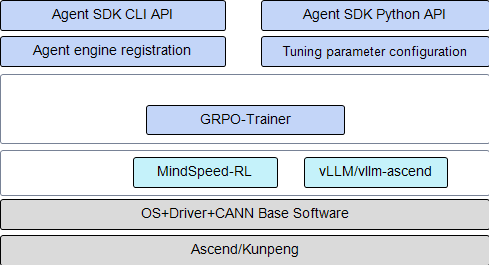

# Introduction

Agent SDK helps users train AI agents quickly.

- Multiple trajectory generation methods with plugin support
- Fused scheduling improving memory efficiency

**Usage Guide**

If you are using this software for the first time, start with the example in [Quick Start](quick_start.md#quick-start) and make sure you prepare the required environment and packages as described there.

If you are already familiar with the process, go directly to [Python API](api_python.md) to get the function interfaces you need and streamline data processing.

# Software Architecture

[Figure 1](#fig173917397815) shows the software architecture of the Agent SDK.

**Figure 1**  Agent SDK software architecture

**Table 1** Modules in the architecture diagram

|Module|Description|
|--|--|
|Agent SDK CLI API|CLI API.|
|Agent SDK Python API|Python API.|
|Agent Engine registration|Implements agent definition and registration of agent engine configuration.|
|Fine-tuning parameter configuration|Parameter configuration for reinforcement learning during the fine-tuning stage, such as `train_iters`.|
|Agentic RL|Core capability layer for Agent RL fine-tuning. It includes agent trajectory generation, multi-turn context memory, distributed resource management, and runtime management for Agent training and inference.|
|GRPO-Trainer|Supports Agent RL fine-tuning with the Group Relative Policy Optimization (GRPO) reinforcement learning algorithm.|

# Supported Hardware and OSs

|Product Series|Product Model|OS Version|
|--|--|--|
|Atlas A2 training products|Atlas 800T A2 training server|Ubuntu 22.04|
