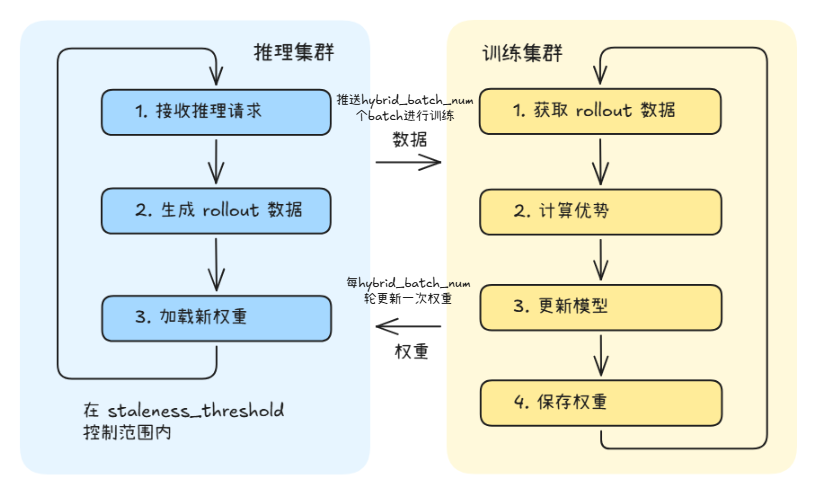
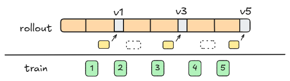

# 混合批次调度使用指南<a name="ZH-CN_TOPIC_MIXED_BATCH_SCHEDULING_GUIDE"></a>

> [!WARNING]
> 混合批次调度为实验特性，建议在小规模测试环境验证收敛效果后再用于生产。

## 简介

混合批次调度（Mixed Batch Scheduling）是AgentSDK在训推分离模式下提供的一种调度优化策略。该策略在分离模式的基础上，让推理端在一次权重更新后连续处理多个训练batch，将推理结果流式发送给训练端，从而减少权重切换频率。

**核心思想：一次权重更新，多次训练产出。**

### 模式与策略

混合批次调度是分离模式的子策略，继承分离模式的两层设计：

- 部署模式：训练和推理部署在不同节点上，并行执行。
- 训练策略：基于One-Step-Off策略（Off-Policy），训练使用上一轮或更早的策略产出的轨迹数据。混合批次调度通过批次合并（一次权重更新后推理端连续产出两个或多个batch）与版本控制机制，确保权重版本与训练数据版本在off-policy下的正确对应。

当配置文件中将`work_mode`设置为`one_step_off`，且同时开启`init_num_group_batches = 2`、`hybrid_batch_num = 2`和 `enable_version_control: true`时，表示选择了混合批次调度优化（以两个batch为例）。

### 运行过程

混合批次调度是分离模式的子策略，训练和推理在不同节点上并行执行，在此基础上优化了推理端的批次处理：



- 训练端初始化时，`initialize_rollout()`向推理队列填充`init_num_group_batches`个batch，建立初始流水线
- 推理端等待队列积累到`hybrid_batch_num`个batch后，一次性取出并合并处理
- 推理端将合并后的数据一次性加载到推理引擎，按子batch粒度流式产出rollout数据，每完成一个子batch立即发送给训练端
- 训练端收到训练batch后开始训练，每轮训练完都导出权重文件并通过HTTP通知推理端
- 推理端通过版本控制机制，每`hybrid_batch_num`轮才真正转换一次权重，中间版本自动跳过

### 适用场景

- 分离式部署，权重切换开销较大（如网络传输、文件I/O较慢）
- 减少推理端权重切换频率，提升NPU利用率
- 对off-policy偏差容忍度较高，允许推理端使用同一份权重处理两个batch

> [!TIP] 提示
> 如果集群资源有限，希望训练和推理共享同一组卡，可参考[训推共卡模式使用指南](02_hybrid.md)。
> 如果希望标准的分离模式（每次权重更新处理一个batch），详情可参考[训推分离使用指南](03_one_step_off.md)。

### 与其它模式的区别

| 特性 | 共卡模式（Hybrid） | 普通分离模式（One-Step-Off） | 混合批次调度（Mixed Batch） |
|------|-------------------|------------------------|--------------------------|
| 部署方式 | 训练和推理在同一组卡上 | 训练和推理在不同节点上 | 训练和推理在不同节点上 |
| 执行方式 | 训练和推理串行交替 | 训练和推理并行执行 | 训练和推理并行执行 |
| 策略类型 | On-Policy | Off-Policy | Off-Policy |
| 每次权重更新处理的 batch 数 | 1 | 1 | N（N=hybrid_batch_num） |
| 权重切换频率 | 每轮 | 每轮 | 每 N 轮 |
| 版本控制 | 无 | 无 | 有（enable_version_control） |
| 显存使用 | 时分复用 | 各自独立占用 | 各自独立占用 |
| 适用规模 | 中小规模集群 | 大规模集群 | 大规模集群（权重切换为瓶颈时） |

## 使用方法

### 步骤 1：修改 hosts.conf

文件路径：`configs/hosts.conf`

混合批次调度是分离模式的子策略，部署方式与分离模式一致：推理节点排在前面，训练节点排在后面，且**不配置`infer_master_index`**。

**双机分离部署**（1台推理 + 1台训练）：

```shell
# host,index,train_master_index,infer_master_index(可选)
192.168.0.1,0,0
192.168.0.2,1,1
```

| 参数 | 说明 |
|------|------|
| host | 节点 IP 地址 |
| index | 节点索引，从 0 开始。**推理节点索引必须小于训练节点索引** |
| train_master_index | 训练主节点标识，设为 1 表示该节点启动训练。**仅在训练节点上配置** |
| infer_master_index | 推理主节点标识。**分离模式下不配置此参数** |

> [!IMPORTANT] 关键配置
> 混合批次调度的hosts.conf配置与普通分离模式完全相同，均为不配置`infer_master_index`。系统根据`VC_TASK_INDEX < MASTER_TRAIN_INDEX`判定节点为推理节点，`VC_TASK_INDEX >= MASTER_TRAIN_INDEX`判定为训练节点。详情可参考[训推分离使用指南](03_one_step_off.md#步骤-1修改-hostsconf)。

### 步骤 2：修改 base.conf

文件路径：`configs/base.conf`

```shell
# 工作模式设置为 one_step_off（混合批次调度是分离模式的子策略）
work_mode=one_step_off

# 训练 YAML 文件（使用 mixed 版本）
train_config_name=verl_train_mixed_A3_t16_qwen3_4b_math_fsdp

# 推理 YAML 文件（分离模式必须配置）
infer_config_name=vllm_infer_i16_qwen3_4b
```

| 参数 | 说明 |
|------|------|
| work_mode | 设为`one_step_off`表示分离模式（混合批次调度是其子策略） |
| train_config_name | 训练YAML配置文件名，**使用`mixed`版本（不含.yaml后缀）** |
| infer_config_name | 推理YAML配置文件名（不含.yaml后缀），**分离模式必须配置** |

### 步骤 3：修改训练 YAML 配置文件

以verl后端、Qwen3-4B模型为例，训练配置文件路径：`configs/train/verl_train_mixed_A3_t16_qwen3_4b_math_fsdp.yaml`

需要根据实际环境修改以下参数。

#### 3.1 必须修改的路径参数

| 参数 | 说明 | 示例                                                 |
|------|------|----------------------------------------------------|
| `hydra.searchpath` | verl配置模板路径，改为aura代码仓中 `configs/train/verl_conf` 目录的绝对路径 | `file:///home/work/aura/configs/train/verl_conf` |
| `verl_conf.extras.data_loader.train_data_path` | 训练数据集路径（bin/idx格式，不含文件后缀） | `/data/train/rl`                                   |
| `verl_conf.actor_rollout_ref.model.path` | 模型权重路径 | `/data/weights/Qwen3-4B`                           |
| `train_instances.rollout_config.llm_tokenizer_path` | 分词器路径（与模型路径一致） | `/data/weights/Qwen3-4B`                           |

#### 3.2 混合批次调度关键配置项

以下配置项是混合批次调度的核心参数，用于控制批次合并与权重版本校验（以Qwen3-4B模型为例，实际请根据模型规格调整）。

**train_instances中work_mode必须为one_step_off：**

```yaml
train_instances:
  - name: RL-QWEN3-4B-WITH-MATH
    executor_kwargs:
      work_mode: one_step_off    # 必须设为 one_step_off
      train_engine: verl
```

**rollout_config中use_on_policy必须为false：**

```yaml
train_instances:
  - name: RL-QWEN3-4B-WITH-MATH
    executor_kwargs:
      rollout_config:
        use_on_policy: false    # 混合批次调度使用 Off-Policy 策略，必须设为 false
```

> [!IMPORTANT] 关键配置
> 混合批次调度基于Off-Policy策略，因此`use_on_policy`必须设为`false`。

**混合批次调度核心参数：**

```yaml
verl_conf:
  extras:
    init_num_group_batches: 2    # 从 DataLoader 首次加载数据批次数量，开启混合批次调度时需要修改为2

train_instances:
  - name: RL-QWEN3-4B-WITH-MATH
    executor_kwargs:
      rollout_config:
        hybrid_batch_num: 2              # 一次权重更新后连续处理的 batch 数量
        enable_version_control: true     # 启用版本控制，跳过中间版本的权重更新
```

| 参数 | 说明 | 推荐值  |
|------|------|------|
| `init_num_group_batches` | 推理端首次加载的batch数量 | 推荐为2 |
| `hybrid_batch_num` | 一次权重更新后推理端连续处理的batch数量。值越大，权重切换频率越低，但off-policy偏差越大 | 推荐为2 |
| `enable_version_control` | 启用版本控制后，推理端只在 `required_version == max_possible_version - 1` 时更新权重，跳过中间版本 | true |

> [!IMPORTANT] 关键配置
> 这三个参数必须协同配置。`hybrid_batch_num`决定权重切换的步长，`init_num_group_batches`确保推理端初始就有足够数据，`enable_version_control`保证off-policy下推理权重版本按照期望更新。

**hybrid_engine 必须关闭：**

```yaml
verl_conf:
  actor_rollout_ref:
    hybrid_engine: False    # 分离模式必须关闭
```

**训练并行度配置：**

```yaml
verl_conf:
  actor_rollout_ref:
    rollout:
      tensor_model_parallel_size: 8    # 训练张量并行大小
      data_parallel_size: 2            # 训练数据并行大小
  trainer:
    n_gpus_per_node: 16               # 每节点卡数
    nnodes: 1                         # 训练节点数
```

**推理引擎配置（infer_instances）：**

分离模式下，`infer_instances`中的以下参数无需手动配置，启动脚本会自动从推理集群获取并替换（[替换逻辑详见 start_verl_train_cluster.sh](../../../../aura/scripts/train/start_verl_train_cluster.sh)）：

- `chat_server`：推理服务地址（由启动脚本用推理主节点 IP 拼接）
- `prefill_server_list`：Prefill实例地址列表（由启动脚本根据推理节点IP自动计算）
- `decode_server_list`：Decode 实例地址列表（由启动脚本根据推理节点IP自动计算）
- `tensor_parallel_size`：推理张量并行大小（来自推理YAML）
- `data_parallel_size`：推理数据并行大小（来自推理YAML）
- `enable_expert_parallel`：是否开启专家并行（来自推理YAML）

> [!NOTE] 前提条件
> 此自动替换机制依赖**共享文件系统**：推理集群将配置写入共享存储的临时文件，训练主节点读取后通过sed替换训练YAML，其他训练节点通过共享文件系统读取修改后的配置。仅训练主节点执行替换操作，避免多节点并发修改冲突。

配置时填入默认值即可：

```yaml
infer_instances:
  - name: Qwen3-4B
    executor_kwargs:
      engine: vllm_proxy
      engine_kwargs:
        chat_server: "http://0.0.0.0:8080"           # 默认即可，启动脚本会自动修改
        prefill_server_list: ["http://0.0.0.0:20012"]  # 默认即可，启动脚本会自动修改
        decode_server_list: []                          # 默认即可，启动脚本会自动修改
        model_name: Qwen3-4B
        tensor_parallel_size: 8                         # 默认即可，启动脚本会自动修改
        data_parallel_size: 2                           # 默认即可，启动脚本会自动修改
        enable_expert_parallel: false                   # 默认即可，启动脚本会自动修改
```

**异步训练配置：**

```yaml
verl_conf:
  async_training:
    use_rollout_log_probs: False
    staleness_threshold: 0.5              # 新鲜度阈值
    trigger_parameter_sync_step: 1        # 训练端每隔多少 iter 同步一次权重
    partial_rollout: False
```

> [!NOTE] 说明
> 混合批次调度下，训练端每轮都会导出权重文件到磁盘。设置hybrid_batch_num为2时，推理端通过开启`enable_version_control`后在两个批次迭代更新一次权重（即第1，3，5...个迭代时进行更新），中间版本的权重文件会被跳过（不转换、不加载），但这些文件仍保留在磁盘上供后续可能的回退使用。

### 步骤 4：修改推理 YAML 配置文件

与普通分离模式一致，需要单独配置推理 YAML 文件，路径：`configs/infer/vllm_infer_i16_qwen3_4b.yaml`

#### 4.1 必须修改的路径参数

| 参数 | 说明 | 示例 |
|------|------|------|
| `infer_model_path` | 模型权重路径 | `/data/weights/Qwen3-4B` |

#### 4.2 推理关键配置项

```yaml
# 模型名称
infer_model_name: Qwen3-4B

# 推理并行度
tensor_parallel_size: 8
data_parallel_size: 2

# 模型输出最大长度
max_model_len: 32768

# 推理显存占用比例
gpu_memory_utilization: 0.6
```

| 参数 | 说明 |
|------|------|
| `tensor_parallel_size` | 推理张量并行大小 |
| `data_parallel_size` | 推理数据并行大小 |
| `max_model_len` | 模型输出最大长度 |
| `gpu_memory_utilization` | 推理显存占用比例 |

#### 4.3 卡资源分配说明

与普通分离模式一致，训练集群和推理集群各自独占卡资源：

- **训练集群卡数** = `n_gpus_per_node` × `nnodes`（训练节点数）
- **推理集群卡数** = `tensor_parallel_size` × `data_parallel_size`

推理集群的节点分配由启动脚本根据推理 YAML 中的并行度参数自动计算。每个推理实例所需卡数为`tensor_parallel_size × data_parallel_size`，所需节点数为 `卡数 / 每节点卡数`。

例如：`tensor_parallel_size=8, data_parallel_size=2`，则推理需要16卡，在A3机器（16卡/节点）上需要1个节点。

### 步骤 5：启动训练

```bash
cd /home/work/AgentSDK/aura
bash scripts/start_rl_with_verl_vllm.sh
```

启动后，系统将根据`hosts.conf`自动识别各节点角色：

- 推理节点启动 vLLM 推理集群
- 训练节点等待推理集群就绪后，启动训练进程

## 工作原理解析

### 混合批次调度执行流程

以`hybrid_batch_num=2` 为例，一次完整的混合批次调度周期如下：

**1. 初始化阶段：**

- 训练端`initialize_rollout()`调用`send_initial_batch_groups_to_rollout()`，向推理队列填充`init_num_group_batches`（2 个）batch
- 推理端启动后，训练端部署完毕并完成初始化，队列中已有2个batch可供消费

**2. 推理阶段：**

- 推理端等待队列积累到2个batch后，一次性取出并合并为一个大batch
- 合并后的数据一次性加载到推理引擎，开始推理
- 推理端将推理结果（minibatch）通过`put_minibatch_to_queue()`放入训练队列
- 推理结果按子 batch 粒度流式发送给训练端，每收集够一个子 batch 的轨迹数据即刻发送

**3. 训练与权重更新阶段：**

- 训练端收到数据后，每轮都进行训练并导出权重文件（如 `iter_0000001/`）
- 训练端通过HTTP通知推理端有新权重可用
- 推理端通过`enable_version_control`校验版本：`required_version = max_possible_version - 1`
- 只有版本匹配时才真正转换和加载权重，中间版本被跳过

### 版本控制机制

版本控制是混合批次调度的核心，确保off-policy下权重版本与训练数据版本的正确对应：



| 概念 | 说明 |
|------|------|
| `max_possible_version` | 初始为0，推理端每次生成后+=`hybrid_batch_num`，表示当前批次组覆盖的最大版本号 |
| `required_version` | `max_possible_version - 1`，即推理端期望接收的权重版本 |
| 版本匹配 | 训练端推送的权重版本 == `required_version`时，执行权重转换和加载 |
| 版本跳过 | 训练端推送的权重版本 != `required_version`时，跳过本次更新，推理端继续使用旧权重 |

以 `hybrid_batch_num=2` 为例，训练端每轮都导出权重，但推理端只接受特定版本：

```text
iter_1 → 通知推理端 → required=1 → 匹配 → 转换加载
iter_2 → 通知推理端 → required=1 → 不匹配 → 跳过
iter_3 → 通知推理端 → required=3 → 匹配 → 转换加载
iter_4 → 通知推理端 → required=3 → 不匹配 → 跳过
...
```

### 与普通分离模式的对比

| 维度 | 普通分离模式 | 混合批次调度 |
|------|------|------|
| 训练端导出频率 | 每轮 | 每轮 |
| 训练端保存权重文件 | 每轮 | 每轮 |
| 推理端权重转换频率 | 每轮 | 每2轮（hybrid_batch_num = 2） |
| 推理端跳过中间版本 | 不跳过 | 通过`enable_version_control`跳过 |
| 单次推理处理的数据量 | 1x | 2x |
| 权重切换次数（200 iter） | 200 次 | 100 次（N=2） |

## 源码实现原理

混合批次调度是分离模式的子策略，启动流程与分离模式完全一致（详见[训推分离使用指南](03_one_step_off.md)），`work_mode=one_step_off`时路由到`verl_async_train`。核心差异在于部署后的批次调度逻辑。

### 启动流程

与普通分离模式相同：

1. **入口脚本** [`start_rl_with_verl_vllm.sh`](../../../../aura/scripts/start_rl_with_verl_vllm.sh)：`get_node_type()`根据`VC_TASK_INDEX`和`MASTER_TRAIN_INDEX`判定节点为`infer`或`train`类型，分别启动推理和训练进程
2. **推理集群启动** [`start_vllm_infer_cluster.sh`](../../../../aura/scripts/infer/start_vllm_infer_cluster.sh)：解析推理配置，启动vLLM推理服务，将服务地址写入共享存储
3. **训练集群启动** [`start_verl_train_cluster.sh`](../../../../aura/scripts/train/start_verl_train_cluster.sh)：等待推理集群就绪，读取临时文件替换训练YAML中的推理配置，启动训练
4. **任务路由** [`train_register.py`](../../../../aura/aura/trainer/trainer_register/train_register.py)：根据`train_engine=verl`和`work_mode=one_step_off`注册并路由到`verl_async_train`

### 批次调度核心链路

| 组件 | 源码位置                                                                                                  | 说明 |
|------|-------------------------------------------------------------------------------------------------------|------|
| 批次合并 | [`rollout_executor.py`](../../../../aura/aura/trainer/rollout/rollout_executor.py)                    | `OneStepOffRolloutExecutor.fit()`中根据`hybrid_batch_num`合并多个batch |
| 版本控制 | [`rollout_weight_manager.py`](../../../../aura/aura/controllers/rollout_controller/rollout_weight_manager.py) | `RolloutWeightManager._should_weights_update()`中根据`enable_version_control`校验权重版本 |
| 版本追踪 | [`rollout_worker.py`](../../../../aura/aura/trainer/rollout/rollout_worker.py)                                | `update_max_version()`在每次推理后更新`max_possible_version` |
| 初始化预加载 | [`train_controller.py`](../../../../aura/aura/controllers/train_controller/train_controller.py)               | `initialize_rollout()`调用`send_initial_batch_groups_to_rollout()`根据`init_num_group_batches`预加载初始数据 |
| 权重同步 | [`rollout_weight_manager.py`](../../../../aura/aura/controllers/rollout_controller/rollout_weight_manager.py) | `sync_weights_update()`执行权重格式转换和版本管理 |

### 训练核心链路

| 组件 | 源码位置 | 说明 |
|------|---------|------|
| 任务入口 | [`full_async/train_main.py`](../../../../aura/aura/trainer/train_adapter/verl/full_async/train_main.py) | `FullyAsyncTaskRunner`初始化训练组件，异步启动 rollout 和训练 |
| 训练器 | [`full_async/full_async_trainer.py`](../../../../aura/aura/trainer/train_adapter/verl/full_async/full_async_trainer.py) | `FullyAsyncTrainer`继承verl的`SeparateRayPPOTrainer`，管理异步训练循环和权重同步 |
| 训练控制器 | [`train_controller.py`](../../../../aura/aura/controllers/train_controller/train_controller.py) | `TrainController`管理训练数据分发、rollout调度和权重版本控制 |

### 推理核心链路

| 组件 | 源码位置 | 说明 |
|------|---------|------|
| Rollout 服务 | [`rollout_service.py`](../../../../aura/aura/trainer/rollout/rollout_service.py) | `start_rollout()`启动rollout进程，与推理集群交互生成rollout数据 |
| 推理服务管理 | [`async_server.py`](../../../../aura/aura/runner/infer_adapter/async_server.py) | `AsyncServerManager`管理分离模式下的推理引擎实例 |
| 权重同步 | [`rollout_weight_manager.py`](../../../../aura/aura/controllers/rollout_controller/rollout_weight_manager.py) | `RolloutWeightManager`负责训练权重到推理引擎的异步同步更新 |

## 常见问题

### Q1：混合批次调度是否必须与分离模式一起使用？

是的。混合批次调度是分离模式的子策略，依赖分离模式的并行执行架构。共卡模式（Hybrid）下`hybrid_batch_num`必须为 1，无法使用混合批次调度。

### Q2：如何确认混合批次调度已生效？

启动日志中确认工作模式：

```text
[INFO] work_mode: one_step_off
```

运行时日志中可搜索以下关键词确认版本控制行为：

```text
|perf-stat|rollout| update_weights ... skip update weights    # 版本被跳过
|perf-stat|rollout| update_weights ... do update weights      # 版本匹配，执行更新
```

### Q3：hybrid_batch_num 应该设置为多少？

推荐设置为2。值越大，权重切换次数越少，但 off-policy 偏差越大（推理端使用同一份权重的时间更长）。建议通过实验对比不同`hybrid_batch_num`下的训练收敛速度和最终效果，选择效果与吞吐的最佳平衡点。

### Q4：混合批次调度与普通分离模式的训练收敛效果有差异吗？

混合批次调度下，推理端使用同一份权重连续处理多个 batch，会导致部分batch的推理结果对应更旧的权重，off-policy偏差略大。在大多数场景下，这种偏差对最终收敛效果的影响可忽略，但建议在使用前通过小规模实验验证。

### Q5：如何判断混合批次调度是否有收益？

在日志中搜索权重切换相关耗时：

```bash
grep -E "perf-stat.*update_weights.*cost|perf-stat.*converted weights succeed|perf-stat.*infer update_weights done" 日志文件
```

如果权重切换耗时（训练导出 + 格式转换 + NPU加载）占总每轮时间的比例很小（如<5%），则混合批次调度可能无明显收益。建议先使用普通分离模式作为基准，确认权重切换是瓶颈后再启用。

### Q6：混合批次调度与普通分离模式的配置文件有哪些差异？

核心差异在于训练 YAML 中的三个参数：

| 参数 | 普通分离模式（async） | 混合批次调度（mixed） |
|------|---------------------|---------------------|
| `init_num_group_batches` | 1 | 2 |
| `hybrid_batch_num` | 1 | 2 |
| `enable_version_control` | false | true |

其余配置（hosts.conf、base.conf和推理YAML）完全相同。从普通分离模式切换到混合批次调度，只需修改上述三个参数即可。
