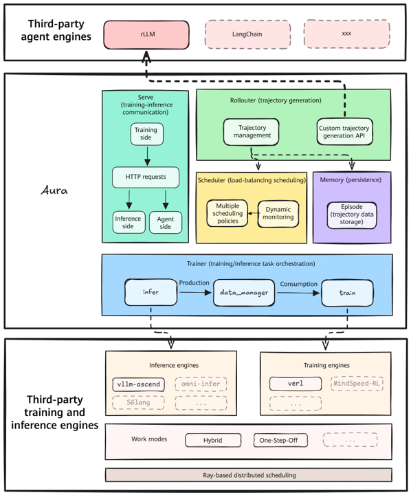

# Introduction

The **Agentic Ultra-fast Reinforcement Architecture (Aura)** is an integrated agentic reinforced learning (RL) training, inference, and tuning framework. It is designed to help foundation models evolve from general language capabilities into intelligent agents equipped with autonomous planning, tool calling, environment interaction, task execution, and long-horizon decision-making through a unified training, inference, and optimization infrastructure.
Driven primarily by task trajectories, environment feedback, and reward signals, **Aura** leverages post-training techniques such as reinforcement learning to discover and enhance the reasoning and decision-making capabilities of foundation models in complex scenarios. By continuously interacting with the environment, models learn improved policies and evolve from "generative models" into "action-oriented agents."
**Aura** provides unified abstract interfaces compatible with multiple training engines, inference engines, and agent frameworks, allowing users to flexibly integrate custom models, task environments, and toolchains to reduce engineering complexity. Developers can use Aura to quickly build intelligent agents for diverse scenarios and continuously improve model capabilities using domain data, feedback signals, and runtime results. Additionally, Aura supports a variety of reinforcement learning algorithms, reward mechanisms, and optimization strategies to provide flexible training and tuning for different tasks, helping models continuously learn, adapt, and evolve in real-world environments.

**Usage Guide**

If you are using this software for the first time, start with the examples in the [Quick Start](03_quick_start.md) guide, and ensure that your environment and required software packages are prepared according to the steps provided.

If you are already familiar with the workflow, you can go directly to the [Python API Reference](05_api_python.md) to locate the required function APIs and accelerate your data processing workflow.

# Software Architecture

Figure 1 shows the Aura software architecture.

**Figure 1** Aura software architecture

**Table 1** Modules in the architecture diagram

| Module | Description |
|---|---|
| **Third-party agent engines** | Supports multiple agent engines, including rLLM. |
| **Serve (training/inference Communication)** | Supports HTTP communication from the training side to the inference and agent sides. |
| **Rollouter (trajectory generation)** | Generates agent trajectories and provides trajectory management and custom trajectory generation interfaces. |
| **Scheduler** | Schedules inference requests and supports load balancing. |
| **Memory** | Persists trajectory data in Episode format. |
| **Trainer (training/inference task orchestration)** | Manages and orchestrates training and inference tasks, using `data_manager` to coordinate data flows between training and inference. |
| **Inference engines** | Supports third-party inference engines, including vLLM-Ascend. |
| **Training engines** | Supports third-party training engines, including veRL. |
| **Ray-based distributed scheduling** | Provides Ray-based distributed resource management and supports both Hybrid and One-Step-Off deployment modes. |

# Supported Features

- [Hybrid Mode (On-Policy)](04_user_guide/02_hybrid.md): Training and inference run cooperatively on the same set of NPUs through time-division multiplexing.
- [One-Step-Off Mode (Off-Policy)](04_user_guide/03_one_step_off.md): Training and inference execute in parallel across different nodes.
- [Custom Agent Integration](04_user_guide/04_custom_agent.md): Integrates custom agents into the Aura training framework.
