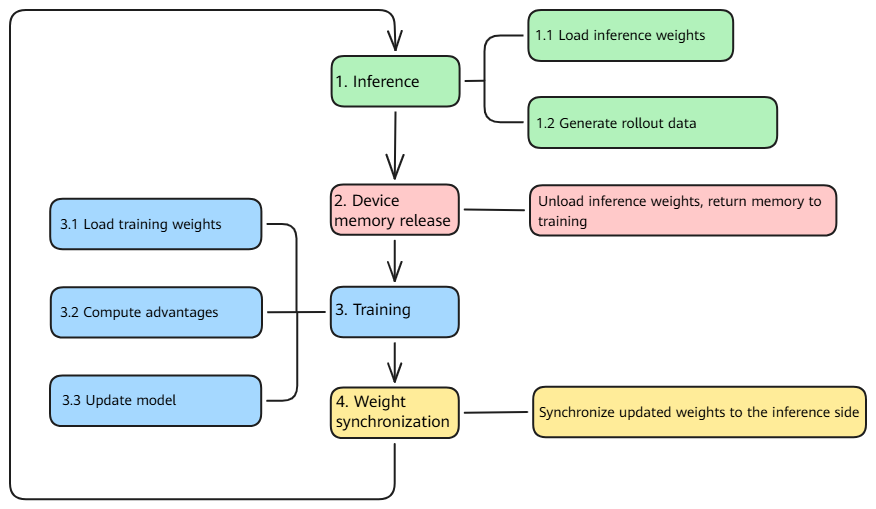

# Hybrid Mode (On-Policy)

## Overview

Hybrid mode is a resource deployment mode provided by Agent SDK that enables training and inference tasks to run on the same set of NPU or GPU devices. Through time-division multiplexing (TDM) of device memory, training and inference alternately use the memory of the same set of devices. This mode is suitable for small- and medium-scale clusters or resource-constrained scenarios.

Hybrid mode is inherently an On-Policy training strategy: inference uses the latest policy to generate data, training immediately consumes the data to update the policy, and the next round of inference then uses the updated policy to generate new data. The entire "generation → training → generation" process forms a closed loop within the same policy version, with no policy lag.

### Modes and Strategies

Agent SDK's Hybrid mode uses a two-layer design:

- **Deployment mode**: specifies how training and inference resources are deployed. Currently, Hybrid and One-Step-Off modes are supported.
- **Training strategy**: specifies how training uses the data generated by inference in Hybrid mode. Hybrid mode inherently uses the On-Policy strategy: inference uses the latest policy to generate data, training immediately consumes the data to update the policy, and the next round of inference then uses the updated policy to generate new data. The entire "generation → training → generation" process forms a closed loop within the same policy version, with no policy lag.

Therefore, when `work_mode` is set to `hybrid` in the configuration file, both the Hybrid deployment mode and the On-Policy synchronous training strategy are selected.

### Running Process

In Hybrid mode, training and inference run alternately in each iteration:



- After the inference phase is complete, the system automatically releases the memory occupied by inference for training.
- After the training phase is complete, the system automatically synchronizes the updated weights to the inference engine.
- The entire process is managed automatically without manual intervention.

### Applicable Scenarios

- The number of available devices in the cluster is limited, making it impossible to deploy separate training and inference clusters.
- You want to reduce the overhead of cross-node communication and data transfer.
- You want inference to directly reuse the model weights already loaded for training and avoid loading the weights again.

> [!NOTE]
> If cluster resources are sufficient and you want training and inference to run in parallel to improve throughput, see [One-Step-Off Mode Usage Guide](03_one_step_off.md). One-Step-Off mode uses the Off-Policy strategy (One-Step-Off), in which training uses trajectory data generated by the previous round's policy.

## Usage

### Step 1: Modifying hosts.conf

File path: `configs/hosts.conf`

Hybrid mode supports both single-node and multi-node deployment. The key is that training and inference share the same set of devices on each node.

For **single-node Hybrid deployment**, configure only one line and set both `train_master_index` and `infer_master_index` to `1`:

```shell
# host,index,train_master_index,infer_master_index (optional)
<node IP>,0,1,1
```

| Parameter | Description |
| --------- | ----------- |
| host | Node IP address. |
| index | Node index, starting from `0`. |
| train_master_index | Training master node indicator. Set to `1` to start training on the node. |
| infer_master_index | Inference master node indicator. Set to `1` to start inference on the node. **This parameter must be configured in Hybrid mode and must have the same value as `train_master_index`.** |

> [!NOTE]
> The key indicator of Hybrid mode is that `train_master_index` and `infer_master_index` point to the same node. The system identifies this node as a `hybrid` node and starts both training and inference on the same node.

### Step 2: Modifying `base.conf`

File path: `configs/base.conf`

```shell
# Set the working mode to hybrid (Hybrid mode with On-Policy training)
work_mode=hybrid

# The training YAML configuration file must be configured in Hybrid mode.
train_config_name=verl_train_hybrid_A3_t16_qwen3_4b_math_fsdp

# infer_config_name does not take effect in Hybrid mode and does not need to be configured.
# infer_config_name=vllm_infer_i16_qwen3_32b
```

| Parameter | Description |
| --------- | ----------- |
| work_mode | Set to `hybrid` to select Hybrid deployment mode (On-Policy strategy). |
| train_config_name | Name of the training YAML configuration file, excluding the `.yaml` extension. |
| infer_config_name | Name of the inference YAML configuration file. **This configuration does not take effect in Hybrid mode.** |

### Step 3: Modifying the Training YAML Configuration File

Using the `verl` backend and Qwen3-4B model as an example, the training configuration file is located at `configs/train/verl_train_hybrid_A3_t16_qwen3_4b_math_fsdp.yaml`.

Modify the following parameters as needed.

#### 3.1 Modifying Required Path Parameters

| Parameter | Description | Example |
| --------- | ----------- | ------- |
| `hydra.searchpath` | Path to the `verl` configuration templates. Change this to the absolute path of the `configs/train/verl_conf` directory in the local Agent SDK repository. | `file:///home/work/AgentSDK/aura/configs/train/verl_conf` |
| `verl_conf.data.train_files` | Path to the training dataset in Parquet format. | `/data/train.parquet` |
| `verl_conf.data.val_files` | Path to the validation dataset in Parquet format. | `/data/test.parquet` |
| `verl_conf.actor_rollout_ref.model.path` | Path to the model weights. | `/data/weights/qwen3-4b` |
| `train_instances.rollout_config.llm_tokenizer_path` | Path to the tokenizer. Use the same path as the model. | `/data/weights/qwen3-4b` |

#### 3.2 Configuring Key Parameters for Hybrid Mode

The following configuration items are essential for Hybrid mode and must be configured correctly. The example uses the Qwen3-4B model. Adjust the actual values according to the model specifications.

**`work_mode` in `train_instances` must be set to `hybrid`:**

```yaml
train_instances:
  - name: RL-QWEN3-4B-WITH-MATH
    executor_kwargs:
      work_mode: hybrid    # Must be set to hybrid
      train_engine: verl
```

**`use_on_policy` in `rollout_config` must be set to `true`:**

```yaml
train_instances:
  - name: RL-QWEN3-4B-WITH-MATH
    executor_kwargs:
      rollout_config:
        use_on_policy: true    # Must be set to true in Hybrid mode to ensure the On-Policy strategy
```

> [!NOTE]
> `use_on_policy` controls whether training uses trajectory data generated by the latest policy. In Hybrid mode, it must be set to `true` to ensure that training uses the data generated by inference in the current round, thereby implementing the On-Policy strategy.

**Configure `hybrid_engine`:**

```yaml
verl_conf:
  actor_rollout_ref:
    hybrid_engine: True    # Must be enabled in Hybrid mode
```

**Configure the training parallelism:**

```yaml
verl_conf:
  actor_rollout_ref:
    rollout:
      tensor_model_parallel_size: 4    # Training tensor parallel size
      data_parallel_size: 2            # Training data parallel size
  trainer:
    n_gpus_per_node: 16                # Number of devices per node
    nnodes: 1                          # Number of nodes
```

**Configure the inference engine (`infer_instances`):**

In Hybrid mode, the inference engine is managed internally by the training process. Only the parallelism parameters need to be configured in `infer_instances`:

```yaml
infer_instances:
  - name: Qwen3-4B
    executor_kwargs:
      engine: vllm_proxy
      engine_kwargs:
        chat_server: "http://0.0.0.0:8080"    # Default value. The startup script modifies it automatically.
        model_name: Qwen3-4B
        tensor_parallel_size: 4                # Inference tensor parallel size
        data_parallel_size: 2                  # Number of inference workers
```

**Configure the agent loop manager:**

Hybrid mode requires `HybridAgentLoopManager`, which manages the interaction loop between agents and the inference engine, including scheduling inference requests, collecting trajectory data, and coordinating memory switching between training and inference:

```yaml
verl_conf:
  actor_rollout_ref:
    rollout:
      agent:
        agent_loop_manager_class: aura.trainer.train_adapter.verl.hybrid.agent_loop_manager.HybridAgentLoopManager
```

#### 3.3 Configuring Device Resources

In Hybrid mode, training and inference share the same set of devices and alternately use device memory through TDM, so no manual resource allocation is required. The total number of devices on a node is determined by `verl_conf.trainer.n_gpus_per_node` × `verl_conf.trainer.nnodes`.

**Training parallelism** is determined by the following parameters.

| Parallelism Dimension | Parameter | Description |
| --------------------- | --------- | ----------- |
| TP (tensor parallelism) | `verl_conf.actor_rollout_ref.rollout.tensor_model_parallel_size` | Tensor parallel size for training. |
| DP (data parallelism) | `verl_conf.actor_rollout_ref.rollout.data_parallel_size` | Data parallel size for training. |

**Inference parallelism** is determined by the following parameters.

| Parallelism Dimension | Parameter | Description |
| --------------------- | --------- | ----------- |
| Tensor parallelism (TP) | `infer_instances.executor_kwargs.engine_kwargs.tensor_parallel_size` | Tensor parallel size for inference. |
| Data parallelism (DP) | `infer_instances.executor_kwargs.engine_kwargs.data_parallel_size` | Number of inference workers. |

> [!NOTE]
> In Hybrid mode, training and inference use the same set of devices and run alternately. The devices perform inference during the inference phase, and the memory is released when inference is complete. The devices then perform training and update the model. Therefore, the number of devices required for training must be the same as that required for inference and must equal the total number of devices on the node. For example, on a single node with 16 devices, training uses TP=4/DP=4 (16 devices), and inference uses TP=4/DP=4 (16 devices). They share the same set of 16 devices.

### Step 4: Starting Agent SDK

```bash
cd /home/work/AgentSDK/aura
bash scripts/start_rl_with_verl_vllm.sh
```

After startup, the system automatically identifies the node as a `hybrid` node and starts the training and inference processes on the same node.

## Implementation Details

The core source code call flow for Hybrid mode is as follows.

### Startup Flow

1. **Run the startup script** [start_rl_with_verl_vllm.sh](../../../../aura/scripts/start_rl_with_verl_vllm.sh): `get_node_type()` determines whether the node is of type `hybrid` based on `MASTER_TRAIN_INDEX` and `MASTER_INFER_INDEX`, and starts the training and inference processes on the same node.
2. **Start the training cluster** [start_verl_train_cluster.sh](../../../../aura/scripts/train/start_verl_train_cluster.sh): Starts the Ray cluster and calls `aura/start.py` to submit the training task.
3. **Route tasks** [train_register.py](../../../../aura/aura/trainer/trainer_register/train_register.py): Registers and routes the task to `verl_hybrid_train` based on `train_engine=verl` and `work_mode=hybrid`.

### Core Training Flow

| Component | Source File | Description |
| --------- | ----------- | ----------- |
| Task entry | [hybrid/train_main.py](../../../../aura/aura/trainer/train_adapter/verl/hybrid/train_main.py) | `HybridTaskRunner` initializes the resource pool and workers and calls `run_ppo()`. |
| Trainer | [hybrid/ray_trainer.py](../../../../aura/aura/trainer/train_adapter/verl/hybrid/ray_trainer.py) | `HybridTrainer` inherits from verl's `RayPPOTrainer` and manages the alternating execution of training and inference. |
| Agent loop | [hybrid/agent_loop_manager.py](../../../../aura/aura/trainer/train_adapter/verl/hybrid/agent_loop_manager.py) | `HybridAgentLoopManager` manages the rollout loop in Hybrid mode and coordinates inference requests and result collection. |

### Core Inference Flow

| Component | Source File | Description |
| --------- | ----------- | ----------- |
| Inference service management | [async_server.py](../../../../aura/aura/runner/infer_adapter/async_server.py) | `AsyncServerProxyManager` manages inference engine instances in Hybrid mode and supports memory switching through `wake_up`/`sleep`. |
| Weight synchronization | [rollout_weight_manager.py](../../../../aura/aura/controllers/rollout_controller/rollout_weight_manager.py) | `RolloutWeightManager` synchronizes updated training weights to the inference engine. |

### Device Memory TDM

In Hybrid mode, training and inference alternately use memory through the `wake_up`/`sleep` mechanism:

- Before the inference phase starts, `wake_up()` is called to load the inference weights into memory.
- After the inference phase ends, `sleep()` is called to unload the inference weights and release the memory for training.
- During the training phase, the released memory is used to update the model.
- After training is complete, `update_weights()` synchronizes the new weights to the inference engine.

## Frequently Asked Questions

### Q1: How can I verify that the system correctly identifies Hybrid mode?

The startup log displays the following information:

```text
[INFO] NODE_TYPE: hybrid
[INFO] work_mode: hybrid
```

If `train` or `infer` is displayed, check whether `train_master_index` and `infer_master_index` in `hosts.conf` both point to the same node.
