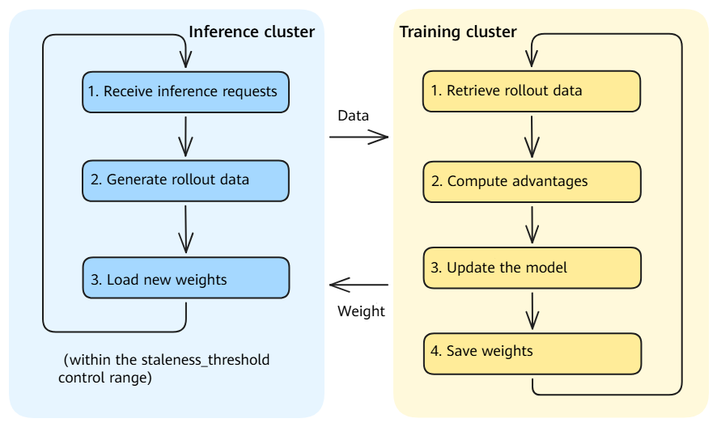

# One-Step-Off Mode (One-Step-Off Strategy)

## Overview

One-Step-Off mode is a resource deployment mode provided by Agent SDK in which training and inference tasks are deployed on different nodes and run independently in parallel. In this mode, the training and inference clusters interact asynchronously through weight files and rollout data. This mode is suitable for large-scale clusters or scenarios that require high training throughput.

### Modes and Strategies

Agent SDK's One-Step-Off mode uses a two-layer design:

- **Deployment mode**: specifies how training and inference resources are deployed. Currently, Hybrid and One-Step-Off modes are supported.
- **Training strategy**: specifies how training uses inference-generated data asynchronously in One-Step-Off mode. Currently, only the One-Step-Off strategy is supported. Training always uses the trajectory data generated by the previous inference round, resulting in a one-iteration lag.

Therefore, when `work_mode` is set to `one_step_off` in the configuration file, both the One-Step-Off deployment mode and the One-Step-Off asynchronous training strategy are selected.

### Running Process

In One-Step-Off mode, training and inference run in parallel on different nodes:



- The inference cluster continuously receives inference requests and generates rollout data.
- The training cluster retrieves rollout data from the data queue, computes advantages, and updates the model.
- After training is complete, the new weights are saved to shared storage, and the inference cluster automatically loads them.

### Applicable Scenarios

- The cluster has sufficient devices to deploy separate training and inference clusters.
- You want training and inference to run in parallel to maximize hardware utilization.
- The volume of inference requests is high and requires a dedicated inference cluster to provide stable service.

> [!NOTE]
> If cluster resources are limited and you want training and inference to share the same set of devices, see [Hybrid Mode Usage Guide](02_hybrid.md).

### Differences from Hybrid Mode

| Feature | Hybrid mode | One-Step-Off mode |
| ------- | ----------- | ----------------- |
| Deployment | Training and inference use the same set of devices | Training and inference run on different nodes |
| Execution | Training and inference run alternately | Training and inference run in parallel |
| Device memory | Memory is time-division multiplexed; inference memory is released for training after inference completes | Training and inference independently occupy device memory |
| Weight synchronization | Weights are synchronized directly to the inference engine after training | Weights are synchronized asynchronously through weight files |
| Applicable scale | Small- and medium-scale clusters | Large-scale clusters |
| Throughput | Affected by long-tail inference latency | Higher throughput through parallel training and inference |

## Usage

### Step 1: Modifying `hosts.conf`

File path: `configs/hosts.conf`

In One-Step-Off mode, inference nodes are listed before training nodes, and **`infer_master_index` must not be configured**.

**Two-node One-Step-Off deployment** (one inference node + one training node):

```shell
# host,index,train_master_index,infer_master_index (optional)
<node IP 1>,0,0
<node IP 2>,1,1
```

| Parameter | Description |
| --------- | ----------- |
| host | Node IP address. |
| index | Node index, starting from `0`. **The inference node index must be smaller than the training node index.** |
| train_master_index | Training master node indicator. Set to `1` to start training on the node. **Configure this parameter only on training nodes.** |
| infer_master_index | Inference master node indicator. **Do not configure this parameter in One-Step-Off mode.** |

> [!NOTE]
> A key characteristic of One-Step-Off mode is that **`infer_master_index` is not configured**. The system identifies a node as an inference node when `VC_TASK_INDEX < MASTER_TRAIN_INDEX` and as a training node when `VC_TASK_INDEX >= MASTER_TRAIN_INDEX`. Inference nodes must be listed before training nodes. For details about the node type detection logic, see [start_rl_with_verl_vllm.sh](../../../../aura/scripts/start_rl_with_verl_vllm.sh). For details about parameter parsing, see [utils.sh](../../../../aura/scripts/base/utils.sh).

### Step 2: Modifying `base.conf`

File path: `configs/base.conf`

```shell
# Set the working mode to one_step_off
work_mode=one_step_off

# Training YAML configuration file
train_config_name=verl_train_async_A3_t16_qwen3_8b_math_fsdp

# Inference YAML configuration file (required in One-Step-Off mode)
infer_config_name=vllm_infer_i16_qwen3_8b
```

| Parameter | Description |
| --------- | ----------- |
| work_mode | Set to `one_step_off` to select One-Step-Off mode. |
| train_config_name | Name of the training YAML configuration file, excluding the `.yaml` extension. |
| infer_config_name | Name of the inference YAML configuration file, excluding the `.yaml` extension. **This parameter is required in One-Step-Off mode.** |

### Step 3: Modifying the Training YAML Configuration File

Using the `verl` backend and Qwen3-8B model as an example, the training configuration file is located at `configs/train/verl_train_async_A3_t16_qwen3_8b_math_fsdp.yaml`.

Modify the following parameters according to your environment.

#### 3.1 Modifying Required Path Parameters

| Parameter | Description | Example |
| --------- | ----------- | ------- |
| `hydra.searchpath` | Path to the `verl` configuration templates. Change this to the absolute path of the `configs/train/verl_conf` directory in the local Agent SDK repository. | `file:///home/work/AgentSDK/aura/configs/train/verl_conf` |
| `verl_conf.extras.data_loader.train_data_path` | Path to the training dataset in bin/idx format, excluding the file extension. | `/data/train/rl` |
| `verl_conf.actor_rollout_ref.model.path` | Path to the model weights. | `/data/weights/qwen3-8b` |
| `train_instances.rollout_config.llm_tokenizer_path` | Path to the tokenizer. Use the same path as the model. | `/data/weights/qwen3-8b` |

#### 3.2 Configuring Key Parameters for One-Step-Off Mode and Strategy

The following configuration items are essential for the correct operation of One-Step-Off deployment and the One-Step-Off strategy. The example uses the Qwen3-8B model. Adjust the actual values according to the model specifications.

**`work_mode` in `train_instances` must be set to `one_step_off`:**

```yaml
train_instances:
  - name: RL-QWEN3-8B-WITH-MATH
    executor_kwargs:
      work_mode: one_step_off    # Must be set to one_step_off
      train_engine: verl
```

**`use_on_policy` in `rollout_config` must be set to `false`:**

```yaml
train_instances:
  - name: RL-QWEN3-8B-WITH-MATH
    executor_kwargs:
      rollout_config:
        use_on_policy: false    # Must be set to false in One-Step-Off mode to ensure the Off-Policy strategy
```

> [!NOTE]
> `use_on_policy` controls whether training uses trajectory data generated by the latest policy. In One-Step-Off mode, it must be set to `false` to ensure that training uses trajectory data generated by the previous policy, thereby implementing the One-Step-Off strategy.

**`hybrid_engine` must be disabled:**

```yaml
verl_conf:
  actor_rollout_ref:
    hybrid_engine: false    # Must be disabled in One-Step-Off mode
```

**Configuring the training parallelism:**

```yaml
verl_conf:
  actor_rollout_ref:
    rollout:
      tensor_model_parallel_size: 8    # Training tensor parallel size
      data_parallel_size: 2            # Training data parallel size
  trainer:
    n_gpus_per_node: 16                # Number of devices per node
    nnodes: 1                          # Number of training nodes
```

**Configuring the inference engine (`infer_instances`):**

In One-Step-Off mode, the following parameters in `infer_instances` do not need to be configured manually. The startup script automatically obtains and replaces them based on the inference cluster. For details, see [start_verl_train_cluster.sh](../../../../aura/scripts/train/start_verl_train_cluster.sh).

- `chat_server`: inference service address, constructed by the startup script using the inference master node IP.
- `prefill_server_list`: list of Prefill instance addresses, automatically calculated by the startup script based on the inference node IP addresses.
- `decode_server_list`: list of Decode instance addresses, automatically calculated by the startup script based on the inference node IP addresses.
- `tensor_parallel_size`: inference tensor parallel size, obtained from the inference YAML configuration.
- `data_parallel_size`: inference data parallel size, obtained from the inference YAML configuration.
- `enable_expert_parallel`: whether expert parallelism is enabled, obtained from the inference YAML configuration.

> [!NOTE]
> This automatic replacement mechanism depends on a **shared file system**. The inference cluster writes the configuration to temporary files on shared storage. The training master node reads these files and uses `sed` to replace the corresponding settings in the training YAML. Other training nodes read the modified configuration through the shared file system. Only the training master node performs the replacement to avoid concurrent modification conflicts across multiple nodes.

Use the default values when configuring these parameters:

```yaml
infer_instances:
  - name: Qwen3-8B
    executor_kwargs:
      engine: vllm_proxy
      engine_kwargs:
        chat_server: "http://0.0.0.0:8080"            # Use the default value; the startup script modifies it automatically.
        prefill_server_list: ["http://0.0.0.0:20012"] # Use the default value; the startup script modifies it automatically.
        decode_server_list: []                         # Use the default value; the startup script modifies it automatically.
        model_name: Qwen3-8B
        tensor_parallel_size: 8                        # Use the default value; the startup script modifies it automatically.
        data_parallel_size: 2                          # Use the default value; the startup script modifies it automatically.
        enable_expert_parallel: false                  # Use the default value; the startup script modifies it automatically.
```

**Configuring asynchronous training:**

One-Step-Off mode supports asynchronous execution of training and inference. The following parameters control the weight synchronization strategy:

```yaml
verl_conf:
  async_training:
    use_rollout_log_probs: false
    staleness_threshold: 0.5          # Staleness threshold
    trigger_parameter_sync_step: 1    # Number of iterations between weight synchronization operations
    partial_rollout: false
```

### Step 4: Modifying the Inference YAML Configuration File

One-Step-Off mode requires a separate inference YAML configuration file. The file is located at `configs/infer/vllm_infer_i16_qwen3_8b.yaml`.

#### 4.1 Modifying Required Path Parameters

| Parameter          | Description                | Example                  |
| ------------------ | -------------------------- | ------------------------ |
| `infer_model_path` | Path to the model weights. | `/data/weights/qwen3-8b` |

#### 4.2 Configuring Key Inference Parameters

```yaml
# Model name
infer_model_name: Qwen3-8B

# Inference parallelism
tensor_parallel_size: 8
data_parallel_size: 2

# Maximum output length of the model
max_model_len: 32768

# Device memory utilization ratio for inference
gpu_memory_utilization: 0.6
```

| Parameter                | Description                                    |
| ------------------------ | ---------------------------------------------- |
| `tensor_parallel_size`   | Inference tensor parallel size.                |
| `data_parallel_size`     | Inference data parallel size.                  |
| `max_model_len`          | Maximum output length of the model.            |
| `gpu_memory_utilization` | Device memory utilization ratio for inference. |

#### 4.3 Configuring Device Resources

In One-Step-Off mode, the training and inference clusters independently occupy their device resources without interfering with each other:

- **Number of training devices** = `n_gpus_per_node` × `nnodes` (number of training nodes)
- **Number of inference devices** = `tensor_parallel_size` × `data_parallel_size`

The startup script automatically determines the inference node allocation based on the parallelism parameters in the inference YAML. Each inference instance requires `tensor_parallel_size × data_parallel_size` devices, and the required number of nodes is `number of devices / number of devices per node`.

For example, with `tensor_parallel_size=8` and `data_parallel_size=2`, inference requires 16 devices. On an A3 machine with 16 devices per node, one node is required.

### Step 5: Starting Agent SDK

```bash
cd /home/work/AgentSDK/aura
bash scripts/start_rl_with_verl_vllm.sh
```

After startup, the system automatically identifies the role of each node based on `hosts.conf`:

- Inference nodes start the vLLM inference cluster.
- Training nodes wait for the inference cluster to become ready before starting the training process.

## Implementation Details

The core source code call flow for One-Step-Off mode is as follows.

### Startup Flow

1. **Run the startup script** [start_rl_with_verl_vllm.sh](../../../../aura/scripts/start_rl_with_verl_vllm.sh): `get_node_type()` determines whether a node is an `infer` or `train` node based on `VC_TASK_INDEX` and `MASTER_TRAIN_INDEX`, and starts the corresponding inference or training process.
2. **Start the inference cluster** [start_vllm_infer_cluster.sh](../../../../aura/scripts/infer/start_vllm_infer_cluster.sh): Parses the inference configuration, starts the vLLM inference service, and writes the service address to shared storage.
3. **Parse the inference configuration** [parse_infer_config.sh](../../../../aura/scripts/infer/vllm/parse_infer_config.sh): Reads the parallelism parameters from the inference YAML, automatically allocates node IP addresses, and writes them to temporary files in `conf_for_train/`.
4. **Start the training cluster** [start_verl_train_cluster.sh](../../../../aura/scripts/train/start_verl_train_cluster.sh): Waits for the inference cluster to become ready, reads the temporary files and replaces the inference configuration in the training YAML, and starts training.
5. **Route tasks** [train_register.py](../../../../aura/aura/trainer/trainer_register/train_register.py): Registers and routes the task to `verl_async_train` based on `train_engine=verl` and `work_mode=one_step_off`.

### Core Training Flow

| Component | Source File | Description |
| --------- | ----------- | ----------- |
| Task entry | [full_async/train_main.py](../../../../aura/aura/trainer/train_adapter/verl/full_async/train_main.py) | `FullyAsyncTaskRunner` initializes the training components and asynchronously starts rollout and training. |
| Trainer | [full_async/full_async_trainer.py](../../../../aura/aura/trainer/train_adapter/verl/full_async/full_async_trainer.py) | `FullyAsyncTrainer` inherits from verl's `SeparateRayPPOTrainer` and manages the asynchronous training loop and weight synchronization. |
| Training controller | [train_controller.py](../../../../aura/aura/controllers/train_controller/train_controller.py) | `TrainController` manages training data distribution, rollout scheduling, and weight version control. |
| Data manager | [data_manager.py](../../../../aura/aura/data_manager/data_manager.py) | `DataManager` manages the loading and distribution of training data. |

### Core Inference Flow

| Component | Source File | Description |
| --------- | ----------- | ----------- |
| Rollout service | [rollout_service.py](../../../../aura/aura/trainer/rollout/rollout_service.py) | `start_rollout()` starts the rollout process and interacts with the inference cluster to generate rollout data. |
| Inference service management | [async_server.py](../../../../aura/aura/runner/infer_adapter/async_server.py) | `AsyncServerManager` manages inference engine instances in One-Step-Off mode. |
| Weight synchronization | [rollout_weight_manager.py](../../../../aura/aura/controllers/rollout_controller/rollout_weight_manager.py) | `RolloutWeightManager` asynchronously synchronizes updated training weights to the inference engine. |

### Automatic Configuration Replacement

In One-Step-Off mode, the inference configuration in the training YAML is automatically replaced by the startup script as follows:

1. When the inference cluster starts, [write_infer_server_list()](../../../../aura/scripts/infer/vllm/parse_infer_config.sh) and [write_infer_parallel_size()](../../../../aura/scripts/infer/vllm/parse_infer_config.sh) write the service addresses and parallelism settings to temporary files on shared storage.
2. When the training cluster starts, [get_infer_server_config()](../../../../aura/scripts/train/start_verl_train_cluster.sh) reads the temporary files.
3. [replace_infer_server_config()](../../../../aura/scripts/train/start_verl_train_cluster.sh) uses `sed` to replace `chat_server`, `prefill_server_list`, `decode_server_list`, `tensor_parallel_size`, `data_parallel_size`, and `enable_expert_parallel` in the training YAML. Only the training master node performs the replacement, which depends on a shared file system.

## Frequently Asked Questions

### Q1: What should I do if the inference cluster fails to start in One-Step-Off mode?

Check the following:

1. Verify that `infer_model_path` in the inference YAML correctly points to the model weights.
2. Verify that the number of devices on the inference nodes satisfies the `tensor_parallel_size × data_parallel_size` requirement.
3. Verify that the inference nodes can access the shared storage where the model weights are stored.

### Q2: How can I verify that the system correctly identifies One-Step-Off mode?

The startup log displays the following information:

```text
[INFO] NODE_TYPE: infer    # Inference node
[INFO] NODE_TYPE: train    # Training node
[INFO] work_mode: one_step_off
```

If the node type is incorrect, check whether `hosts.conf` and `base.conf` are configured correctly.

### Q3: What should I do if the training cluster times out while waiting for the inference cluster to become ready?

In One-Step-Off mode, the training cluster waits for the inference cluster to start before beginning training. If the inference cluster takes a long time to start, the training log continuously displays:

```text
[WARN] external vllm cluster is not ready, waiting 5 seconds...
```

This is normal. Training automatically continues after the inference cluster becomes ready. If the inference cluster does not become ready after an extended period, check the inference cluster startup logs.
