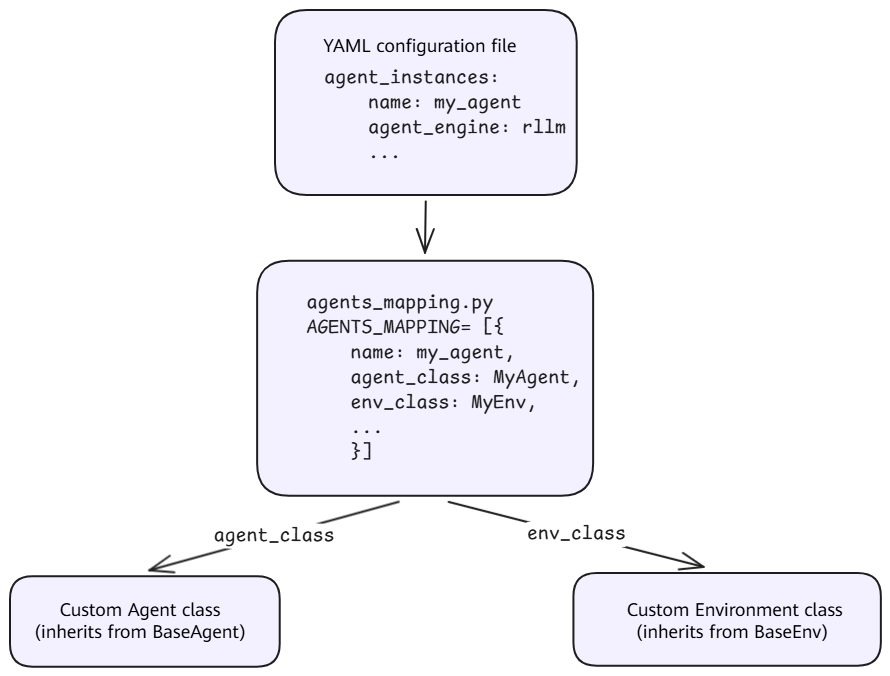

# Custom Agent Integration

## Overview

Agent SDK provides a flexible agent integration mechanism, allowing users to integrate custom agents into the Aura training, inference, and orchestration framework. By implementing the two core abstract classes (`BaseAgent` and `BaseEnv`) and registering the custom agent in `agents_mapping.py`, you can enable the custom agent to participate in the reinforcement learning training loop.

### Core Concepts

The agent architecture in Agent SDK consists of the following core components.

| Component | Description |
| --------- | ----------- |
| **Agent** | Interacts with the model, parses model outputs into tool calls, and maintains the conversation history. |
| **Environment** | Executes tool calls and returns observations and reward signals. |
| **Tool** | Defines tools that an agent can call, including their description and execution logic. |
| **Reward Function** | A reward function that evaluates the quality of agent behavior. |
| **`agents_mapping`** | An agent registry that maps names to specific Agent/Env/Reward configurations. |

### Architecture Overview



## Quick Start

### Step 1: Implementing a Custom Agent

A custom agent must inherit from [BaseAgent](../../../../aura/aura/runner/agent_engine_wrapper/base/agent/base_agent.py) and implement the following abstract methods:

```python
from aura.runner.agent_engine_wrapper.base.agent.base_agent import BaseAgent, Action, Step, Trajectory

class MyAgent(BaseAgent):
    def __init__(self, system_prompt="You are a helpful assistant.", **kwargs):
        """Initialize the agent state and set the system prompt."""
        self.system_prompt = system_prompt
        self._trajectory = Trajectory()
        self.messages = []
        self.reset()

    def update_from_env(self, observation, reward, done, info, **kwargs):
        """Receive environment feedback, format the observation as a message, and append it to the conversation history."""
        pass

    def update_from_model(self, response, **kwargs) -> Action:
        """Receive the model output, parse it into a tool call, and record it in the trajectory."""
        pass

    def reset(self):
        """Reset the agent state and start a new episode."""
        pass

    @property
    def chat_completions(self):
        return self.messages

    @property
    def trajectory(self):
        return self._trajectory
```

**Key method descriptions**

| Method | Description | When to Call |
| ------ | ----------- | ------------ |
| `update_from_env` | Receives environment feedback and formats it as a message. | After each observation is returned by the environment. |
| `update_from_model` | Parses model output into a tool call. | After each response is generated by the model. |
| `reset` | Resets the state and starts a new episode. | At the beginning of each episode. |
| `chat_completions` | Returns the current conversation history. | When input is obtained for model inference. |
| `trajectory` | Returns the trajectory record. | When rollout data is obtained for training. |

> [!NOTE]
> For a complete implementation, see the built-in agent [ToolAgent](../../../../aura/agents/math_agent/tool_agent.py).

### Step 2: Implementing a Custom Environment

A custom environment must inherit from [BaseEnv](../../../../aura/aura/runner/agent_engine_wrapper/base/environment/base_env.py) and implement the following abstract methods:

```python
from aura.runner.agent_engine_wrapper.base.environment.base_env import BaseEnv

class MyEnvironment(BaseEnv):
    def __init__(self, *args, **kwargs):
        """Initialize the Environment state."""
        pass

    def reset(self):
        """Reset the Environment."""
        pass

    def step(self, action):
        """Execute an action."""
        pass

    @staticmethod
    def from_dict(env_args):
        """Construct an Environment instance from a configuration dictionary."""
        pass
```

**Key methods**

| Method | Description | Return Value |
| ------ | ----------- | ------------ |
| `reset` | Resets the Environment. | `(observation, info)` |
| `step` | Executes one interaction step. | `(observation, reward, done, info)` |
| `from_dict` | Constructs an instance from a configuration dictionary. | `BaseEnv` instance |

> [!NOTE]
> For a complete implementation, see the built-in Environment [ToolEnvironment](../../../../aura/agents/math_agent/environment/tool_env.py).

### Step 3: Registering the Agent in `agents_mapping`

Add the custom agent configuration to the `AGENTS_MAPPING` list in [agents/agents_mapping.py](../../../../aura/agents/agents_mapping.py):

```python
from agents.my_agent.my_agent import MyAgent
from agents.my_agent.my_env import MyEnvironment

AGENTS_MAPPING = [
    # ... existing configurations ...
    {
        "name": "my_agent",
        "env_class": MyEnvironment,
        "env_args": {
            "max_steps": 10,
            ... # Other Environment initialization parameters
        },
        "agent_class": MyAgent,
        "agent_args": {
            "parser_name": "qwen",
            "system_prompt": "You are a helpful assistant.",
            ... # Other Agent initialization parameters
        },
    },
]
```

**Registration fields**

| Field | Type | Description |
| ----- | ---- | ----------- |
| `name` | str | Agent name, referenced by `agent_name` in the YAML configuration. |
| `agent_class` | type | Agent class that inherits from `BaseAgent`. |
| `agent_args` | dict | Agent initialization parameters. |
| `env_class` | type | Environment class that inherits from `BaseEnv`. |
| `env_args` | dict | Environment initialization parameters. |
| `compute_trajectory_reward_fn` | Callable | Function for calculating trajectory-level rewards. |
| `chat_parser` | type | Custom Chat template parser. |

### Step 4: Configuring the YAML File

Reference the custom agent in `agent_instances` in the training configuration YAML:

```yaml
agent_instances:
  - name: MY_AGENT
    executor_num: 1
    executor_kwargs:
      agent_engine: rllm
      agent_engine_kwargs:
        agent_name: my_agent          # Corresponds to the name registered in agents_mapping
        simplify_think_content: false
        max_prompt_length: 4096
        max_model_len: 32768
        n_parallel_agents: 1024
        token_in_token_out: true
        env_args:                     # Merged into env_args in agents_mapping
          max_steps: 5
          tool_timeout: 200
          trajectory_timeout: 7200
        tokenizer: ${verl_conf.actor_rollout_ref.model.path}
      infer_service_params:
        temperature: 1.0
        top_p: 1.0
        max_tokens: 8192
        model: ${infer_instances.0.name}
      trajectory_save_dir: ${hydra:runtime.cwd}/outputs
    resource_info: []
```

**`agent_instances` parameters**

| Parameter | Description |
| --------- | ----------- |
| `name` | Agent service name, referenced by `agent_service` in the training configuration. |
| `executor_num` | Number of agent executors. |
| `executor_kwargs.agent_engine` | Agent engine type. Use `rllm`. |
| `executor_kwargs.agent_engine_kwargs.agent_name` | Agent name registered in `agents_mapping`. |
| `executor_kwargs.agent_engine_kwargs.env_args` | Environment parameters, which are merged with `env_args` in `agents_mapping`. |
| `executor_kwargs.infer_service_params` | Model inference sampling parameters. |
| `executor_kwargs.trajectory_save_dir` | Directory for saving trajectories. |

### Parameter Merging Mechanism

Parameters in `agent_engine_kwargs` in the YAML configuration are merged with the registered parameters in `agents_mapping` according to the following rules:

- `env_args`: YAML configuration and `agents_mapping` are merged, with the values in the YAML configuration taking precedence.
- `agent_args`: YAML configuration and `agents_mapping` are merged, with the values in the YAML configuration taking precedence.
- `tokenizer`: Automatically injected through `tokenizer: ${verl_conf.actor_rollout_ref.model.path}` in the YAML configuration.

For the source code of the merging logic, see [rllm_engine_wrapper.py](../../../../aura/aura/runner/agent_engine_wrapper/rllm/rllm_engine_wrapper.py):

```python
env_args = self.env_args | kwargs.get("env_args", {})
agent_args = self.agent_args | kwargs.get("agent_args", {})
```

## Built-in Agent Reference

Agent SDK provides the following built-in agent, which can be used as a reference for implementing a custom agent.

| Agent Name | Class | Description |
| ---------- | ----- | ----------- |
| `math` | [ToolAgent](../../../../aura/agents/math_agent/tool_agent.py) | Mathematical reasoning agent that supports Python code execution tools. |

## Implementation Details

| Component | Source File | Description |
| --------- | ----------- | ----------- |
| Agent registry | [agents/agents_mapping.py](../../../../aura/agents/agents_mapping.py) | Defines all built-in agent configurations and provides `get_agent_by_name()` for lookup. |
| Agent base class | [base/agent/base_agent.py](../../../../aura/aura/runner/agent_engine_wrapper/base/agent/base_agent.py) | `BaseAgent` abstract class that defines the agent interface. |
| Environment base class | [base/environment/base_env.py](../../../../aura/aura/runner/agent_engine_wrapper/base/environment/base_env.py) | `BaseEnv` abstract class that defines the environment interface. |
| Agent executor | [agent_executor.py](../../../../aura/aura/runner/agent_service/agent_executor.py) | `AgentExecutor`, which creates an `RLLMEngineWrapper`. |
| Agent manager | [agent_manager.py](../../../../aura/aura/runner/agent_manager.py) | `AgentManager`, which reads the configuration and creates executor instances. |
| Agent router | [agent_router.py](../../../../aura/aura/runner/agent_router.py) | `AgentRouter`, which routes requests to specific executors. |
| RLLM engine | [rllm_engine_wrapper.py](../../../../aura/aura/runner/agent_engine_wrapper/rllm/rllm_engine_wrapper.py) | `RLLMEngineWrapper`, the local agent execution engine. |

## FAQ

**Q1: How are parameters in `env_args` passed to a custom environment?**

The `env_args` in the YAML configuration are merged with the `env_args` in `agents_mapping` and then passed to the environment through `env_class.from_dict()`. A custom environment must implement the `from_dict` static method to parse these parameters.

**Q2: How can I debug a custom agent?**

You can add logs to `update_from_model` and `update_from_env`, or set `trajectory_save_dir` to save trajectories to JSONL files for offline analysis.

**Q3: Can a custom agent work without tools?**

Yes. If the agent does not need to call tools, you can always return the `finish` action in `update_from_model`. In this case, the agent behaves similarly to a single-turn conversation, where the model output is the final answer.
