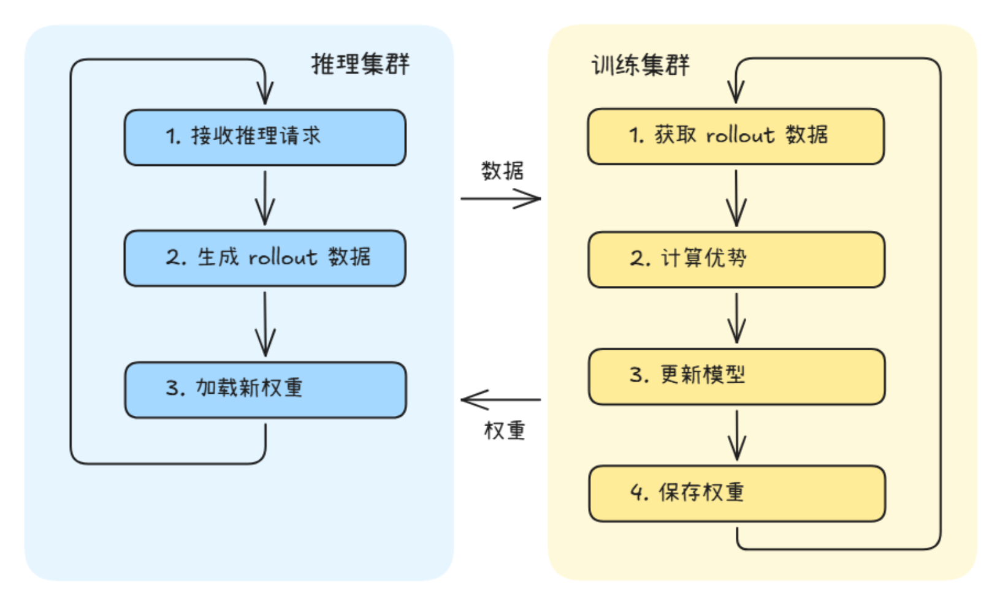

# 训推分离使用指南（One-Step-Off 策略）

## 简介

训推分离是 AgentSDK 提供的一种资源部署模式，训练与推理任务分别部署在不同节点上，独立运行、并行执行。在该模式下，训练集群和推理集群通过权重文件和 rollout 数据进行异步交互，适用于大规模集群或对训练吞吐有较高要求的场景。

### 模式与策略

AgentSDK 的训推分离采用两层设计：

- 部署模式：指训练和推理的资源部署方式，目前支持训推分离和训推共卡。
- 训练策略：指在分离模式下，训练如何利用推理产生的数据的异步策略。目前仅支持 One-Step-Off 策略，即训练始终使用上一轮推理产出的轨迹数据，保持一个迭代步的滞后。

因此，当配置文件中将 work_mode 设置为 one_step_off 时，表示同时选择了“分离部署模式”和“One-Step-Off 异步训练策略”。

### 运行过程

分离模式下，训练和推理在不同节点上并行执行：



- 推理集群持续接收推理请求，生成 rollout 数据
- 训练集群从数据队列获取 rollout 数据，计算优势并更新模型
- 训练完成后，将新权重保存到共享存储，推理集群自动加载

### 适用场景

- 集群卡数充足，可以分别部署训练和推理集群
- 希望训练与推理并行执行，最大化硬件利用率
- 推理请求量大，需要独立的推理集群提供稳定服务

> [!NOTE]
> 如果集群资源有限，希望训练和推理共享同一组卡，可参考[训推共卡模式使用指南](02_hybrid.md)。

### 与共卡模式的区别

| 特性 | 共卡模式（Hybrid） | 分离模式（One-Step-Off） |
|------|-------------------|------------------------|
| 部署方式 | 训练和推理在同一组卡上 | 训练和推理在不同节点上 |
| 执行方式 | 训练和推理串行交替 | 训练和推理并行执行 |
| 显存使用 | 时分复用，推理完释放显存给训练 | 各自独立占用显存 |
| 权重同步 | 训练完直接同步到推理引擎 | 通过权重文件异步同步 |
| 适用规模 | 中小规模集群 | 大规模集群 |
| 吞吐量 | 受推理长尾影响 | 训练和推理并行，吞吐更高 |

## 使用方法

### 步骤 1：修改 hosts.conf

文件路径：`configs/hosts.conf`

分离模式下，推理节点排在前面，训练节点排在后面，且**不配置 `infer_master_index`**：

**双机分离部署**（1 台推理 + 1 台训练）：

```shell
# host,index,train_master_index,infer_master_index(可选)
<节点IP1>,0,0
<节点IP2>,1,1
```

| 参数 | 说明 |
|------|------|
| host | 节点 IP 地址 |
| index | 节点索引，从 0 开始。**推理节点索引必须小于训练节点索引** |
| train_master_index | 训练主节点标识，设为 1 表示该节点启动训练。**仅在训练节点上配置** |
| infer_master_index | 推理主节点标识。**分离模式下不配置此参数** |

> [!NOTE]
> 分离模式的关键标志是**不配置 `infer_master_index`**。系统根据 `VC_TASK_INDEX < MASTER_TRAIN_INDEX` 判定节点为推理节点，`VC_TASK_INDEX >= MASTER_TRAIN_INDEX` 判定为训练节点。推理节点必须排在训练节点前面（节点类型判断逻辑详见 [start_rl_with_verl_vllm.sh](../../../../aura/scripts/start_rl_with_verl_vllm.sh)，参数解析详见 [utils.sh](../../../../aura/scripts/base/utils.sh)）。

### 步骤 2：修改 base.conf

文件路径：`configs/base.conf`

```shell
# 工作模式设置为 one_step_off
work_mode=one_step_off

# 训练yaml文件
train_config_name=verl_train_async_A3_t16_qwen3_8b_math_fsdp

# 推理yaml文件（分离模式必须配置）
infer_config_name=vllm_infer_i16_qwen3_8b
```

| 参数 | 说明 |
|------|------|
| work_mode | 设为 `one_step_off` 表示分离模式 |
| train_config_name | 训练 YAML 配置文件名（不含 .yaml 后缀） |
| infer_config_name | 推理 YAML 配置文件名（不含 .yaml 后缀），**分离模式必须配置** |

### 步骤 3：修改训练 YAML 配置文件

以 verl 后端、Qwen3-8B 模型为例，训练配置文件路径：`configs/train/verl_train_async_A3_t16_qwen3_8b_math_fsdp.yaml`

需要根据实际环境修改以下参数：

#### 3.1 必须修改的路径参数

| 参数                                                  | 说明                                                           | 示例                                               |
|-----------------------------------------------------|--------------------------------------------------------------|--------------------------------------------------|
| `hydra.searchpath`                                  | verl 配置模板路径，改为本机 aura 代码仓中 `configs/train/verl_conf` 目录的绝对路径 | `file:///home/work/aura/configs/train/verl_conf` |
| `verl_conf.extras.data_loader.train_data_path`      | 训练数据集路径（bin/idx 格式，不含文件后缀）                                   | `/data/train/rl`                                 |
| `verl_conf.actor_rollout_ref.model.path`            | 模型权重路径                                                       | `/data/weights/qwen3-8b`                         |
| `train_instances.rollout_config.llm_tokenizer_path` | 分词器路径（与模型路径一致）                                               | `/data/weights/qwen3-8b`                         |

#### 3.2 分离模式 + One-Step-Off 策略关键配置项

以下配置项是保证分离部署与 One-Step-Off 策略正确运行的核心参数（以 Qwen3-8B 模型为例，实际请根据模型规格调整）。

**train_instances 中 work_mode 必须为 one_step_off：**

```yaml
train_instances:
  - name: RL-QWEN3-8B-WITH-MATH
    executor_kwargs:
      work_mode: one_step_off    # 必须设为 one_step_off
      train_engine: verl
```

**rollout_config 中 use_on_policy 必须为 false：**

```yaml
train_instances:
  - name: RL-QWEN3-8B-WITH-MATH
    executor_kwargs:
      rollout_config:
        use_on_policy: false    # 分离模式必须设为 false，保证 Off-Policy 策略
```

> [!NOTE]
> `use_on_policy` 控制训练是否使用当前最新策略生成的轨迹数据。分离模式下必须设为 `false`，确保训练使用上一轮策略产出的轨迹数据，即 One-Step-Off 策略。

**hybrid_engine 必须关闭：**

```yaml
verl_conf:
  actor_rollout_ref:
    hybrid_engine: False    # 分离模式必须关闭
```

**训练并行度配置：**

```yaml
verl_conf:
  actor_rollout_ref:
    rollout:
      tensor_model_parallel_size: 8    # 训练张量并行大小
      data_parallel_size: 2            # 训练数据并行大小
  trainer:
    n_gpus_per_node: 16               # 每节点卡数
    nnodes: 1                         # 训练节点数
```

**推理引擎配置（infer_instances）：**

分离模式下，`infer_instances` 中的以下参数无需手动配置，启动脚本会自动从推理集群获取并替换（[替换逻辑详见 start_verl_train_cluster.sh](../../../../aura/scripts/train/start_verl_train_cluster.sh)）：

- `chat_server`：推理服务地址（由启动脚本用推理主节点 IP 拼接）
- `prefill_server_list`：Prefill 实例地址列表（由启动脚本根据推理节点 IP 自动计算）
- `decode_server_list`：Decode 实例地址列表（由启动脚本根据推理节点 IP 自动计算）
- `tensor_parallel_size`：推理张量并行大小（来自推理 YAML）
- `data_parallel_size`：推理数据并行大小（来自推理 YAML）
- `enable_expert_parallel`：是否开启专家并行（来自推理 YAML）

> [!NOTE]
> 此自动替换机制依赖**共享文件系统**：推理集群将配置写入共享存储的临时文件，训练主节点读取后通过 sed 替换训练 YAML，其他训练节点通过共享文件系统读取修改后的配置。仅训练主节点执行替换操作，避免多节点并发修改冲突。

配置时填入默认值即可：

```yaml
infer_instances:
  - name: Qwen3-8B
    executor_kwargs:
      engine: vllm_proxy
      engine_kwargs:
        chat_server: "http://0.0.0.0:8080"           # 默认即可，启动脚本会自动修改
        prefill_server_list: ["http://0.0.0.0:20012"]  # 默认即可，启动脚本会自动修改
        decode_server_list: []                          # 默认即可，启动脚本会自动修改
        model_name: Qwen3-8B
        tensor_parallel_size: 8                         # 默认即可，启动脚本会自动修改
        data_parallel_size: 2                           # 默认即可，启动脚本会自动修改
        enable_expert_parallel: false                   # 默认即可，启动脚本会自动修改
```

**异步训练配置：**

分离模式支持训练和推理异步执行，通过以下参数控制权重同步策略：

```yaml
verl_conf:
  async_training:
    use_rollout_log_probs: False
    staleness_threshold: 0.5              # 新鲜度阈值
    trigger_parameter_sync_step: 1        # 每隔多少 iter 同步一次权重
    partial_rollout: False
```

### 步骤 4：修改推理 YAML 配置文件

分离模式需要单独配置推理 YAML 文件，路径：`configs/infer/vllm_infer_i16_qwen3_8b.yaml`

#### 4.1 必须修改的路径参数

| 参数 | 说明 | 示例 |
|------|------|------|
| `infer_model_path` | 模型权重路径 | `/data/weights/qwen3-8b` |

#### 4.2 推理关键配置项

```yaml
# 模型名称
infer_model_name: Qwen3-8B

# 推理并行度
tensor_parallel_size: 8
data_parallel_size: 2

# 模型输出最大长度
max_model_len: 32768

# 推理显存占用比例
gpu_memory_utilization: 0.6
```

| 参数 | 说明 |
|------|------|
| `tensor_parallel_size` | 推理张量并行大小 |
| `data_parallel_size` | 推理数据并行大小 |
| `max_model_len` | 模型输出最大长度 |
| `gpu_memory_utilization` | 推理显存占用比例 |

#### 4.3 卡资源分配说明

分离模式下，训练集群和推理集群各自独占卡资源，互不干扰：

- **训练集群卡数** = `n_gpus_per_node` × `nnodes`（训练节点数）
- **推理集群卡数** = `tensor_parallel_size` × `data_parallel_size`

推理集群的节点分配由启动脚本根据推理 YAML 中的并行度参数自动计算。每个推理实例所需卡数为 `tensor_parallel_size × data_parallel_size`，所需节点数为 `卡数 / 每节点卡数`。

例如：`tensor_parallel_size=8, data_parallel_size=2`，则推理需要 16 卡，在 A3 机器（16 卡/节点）上需要 1 个节点。

### 步骤 5：启动训练

```bash
cd /home/work/AgentSDK/aura
bash scripts/start_rl_with_verl_vllm.sh
```

启动后，系统将根据 `hosts.conf` 自动识别各节点角色：

- 推理节点启动 vLLM 推理集群
- 训练节点等待推理集群就绪后，启动训练进程

## 源码实现原理

分离模式的核心源码调用链路如下：

### 启动流程

1. **入口脚本** [start_rl_with_verl_vllm.sh](../../../../aura/scripts/start_rl_with_verl_vllm.sh)：`get_node_type()` 根据 `VC_TASK_INDEX` 和 `MASTER_TRAIN_INDEX` 判定节点为 `infer` 或 `train` 类型，分别启动推理和训练进程
2. **推理集群启动** [start_vllm_infer_cluster.sh](../../../../aura/scripts/infer/start_vllm_infer_cluster.sh)：解析推理配置，启动 vLLM 推理服务，将服务地址写入共享存储
3. **推理配置解析** [parse_infer_config.sh](../../../../aura/scripts/infer/vllm/parse_infer_config.sh)：从推理 YAML 读取并行度参数，自动分配节点 IP，写入 `conf_for_train/` 临时文件
4. **训练集群启动** [start_verl_train_cluster.sh](../../../../aura/scripts/train/start_verl_train_cluster.sh)：等待推理集群就绪，读取临时文件替换训练 YAML 中的推理配置，启动训练
5. **任务路由** [train_register.py](../../../../aura/aura/trainer/trainer_register/train_register.py)：根据 `train_engine=verl` 和 `work_mode=one_step_off` 注册并路由到 `verl_async_train`

### 训练核心链路

| 组件 | 源码位置 | 说明 |
|------|---------|------|
| 任务入口 | [full_async/train_main.py](../../../../aura/aura/trainer/train_adapter/verl/full_async/train_main.py) | `FullyAsyncTaskRunner` 初始化训练组件，异步启动 rollout 和训练 |
| 训练器 | [full_async/full_async_trainer.py](../../../../aura/aura/trainer/train_adapter/verl/full_async/full_async_trainer.py) | `FullyAsyncTrainer` 继承 verl 的 `SeparateRayPPOTrainer`，管理异步训练循环和权重同步 |
| 训练控制器 | [train_controller.py](../../../../aura/aura/controllers/train_controller/train_controller.py) | `TrainController` 管理训练数据分发、rollout 调度和权重版本控制 |
| 数据管理 | [data_manager.py](../../../../aura/aura/data_manager/data_manager.py) | `DataManager` 管理训练数据的加载和分发 |

### 推理核心链路

| 组件 | 源码位置 | 说明 |
|------|---------|------|
| Rollout 服务 | [rollout_service.py](../../../../aura/aura/trainer/rollout/rollout_service.py) | `start_rollout()` 启动 rollout 进程，与推理集群交互生成 rollout 数据 |
| 推理服务管理 | [async_server.py](../../../../aura/aura/runner/infer_adapter/async_server.py) | `AsyncServerManager` 管理分离模式下的推理引擎实例 |
| 权重同步 | [rollout_weight_manager.py](../../../../aura/aura/controllers/rollout_controller/rollout_weight_manager.py) | `RolloutWeightManager` 负责训练权重到推理引擎的异步同步更新 |

### 配置自动替换机制

分离模式下，训练 YAML 中的推理配置由启动脚本自动替换，流程如下：

1. 推理集群启动时，[write_infer_server_list()](../../../../aura/scripts/infer/vllm/parse_infer_config.sh) 和 [write_infer_parallel_size()](../../../../aura/scripts/infer/vllm/parse_infer_config.sh) 将服务地址和并行度写入共享存储的临时文件
2. 训练集群启动时，[get_infer_server_config()](../../../../aura/scripts/train/start_verl_train_cluster.sh) 读取临时文件
3. [replace_infer_server_config()](../../../../aura/scripts/train/start_verl_train_cluster.sh) 用 sed 替换训练 YAML 中的 `chat_server`、`prefill_server_list`、`decode_server_list`、`tensor_parallel_size`、`data_parallel_size`、`enable_expert_parallel`（仅训练主节点执行替换，依赖共享文件系统）

## 常见问题

### Q1：分离模式下推理集群启动失败怎么办？

检查以下几点：

1. 推理 YAML 中的 `infer_model_path` 是否正确指向模型权重路径
2. 推理节点的卡数是否满足 `tensor_parallel_size × data_parallel_size` 的要求
3. 推理节点是否可以访问共享存储（权重文件路径）

### Q2：如何确认系统正确识别为分离模式？

启动日志中会打印以下信息：

```text
[INFO] NODE_TYPE: infer    # 推理节点
[INFO] NODE_TYPE: train    # 训练节点
[INFO] work_mode: one_step_off
```

如果节点类型显示不正确，请检查 `hosts.conf` 和 `base.conf` 是否配置正确。

### Q3：训练集群等待推理集群就绪超时怎么办？

分离模式下训练集群会等待推理集群启动完成后才开始训练。如果推理集群启动较慢，训练日志中会持续打印：

```text
[WARN] external vllm cluster is not ready, waiting 5 seconds...
```

这是正常现象，等待推理集群就绪后会自动继续。如果长时间无法就绪，请检查推理集群的启动日志。
