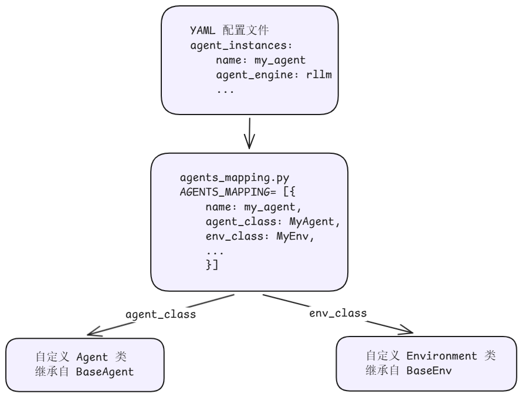

# 自定义 Agent 接入指南

## 简介

AgentSDK 提供了灵活的 Agent 接入机制，允许用户将自定义的智能体接入 Aura 训推调框架。通过实现 `BaseAgent` 和 `BaseEnv` 两个核心抽象类，并在 `agents_mapping.py` 中注册，即可让自定义 Agent 参与强化学习训练循环。

### 核心概念

AgentSDK 的 Agent 体系由以下核心组件构成：

| 组件 | 说明 |
|------|------|
| **Agent** | 负责与模型交互，解析模型输出为工具调用，维护对话历史 |
| **Environment** | 负责执行工具调用，返回观测结果和奖励信号 |
| **Tool** | Agent 可调用的工具，定义工具描述和执行逻辑 |
| **Reward Function** | 评估 Agent 行为质量的奖励函数 |
| **agents_mapping** | Agent 注册表，将名称映射到具体的 Agent/Env/Reward 配置 |

### 架构总览



## 快速开始

### 步骤一：实现自定义 Agent

自定义 Agent 需要继承 [`BaseAgent`](../../../../aura/aura/runner/agent_engine_wrapper/base/agent/base_agent.py)，实现以下抽象方法：

```python
from aura.runner.agent_engine_wrapper.base.agent.base_agent import BaseAgent, Action, Step, Trajectory

class MyAgent(BaseAgent):
    def __init__(self, system_prompt="You are a helpful assistant.", **kwargs):
        """初始化 Agent 状态，设置系统提示词"""
        self.system_prompt = system_prompt
        self._trajectory = Trajectory()
        self.messages = []
        self.reset()

    def update_from_env(self, observation, reward, done, info, **kwargs):
        """接收环境反馈，将观测格式化为消息追加到对话历史"""
        pass

    def update_from_model(self, response, **kwargs) -> Action:
        """接收模型输出，解析为工具调用，记录到轨迹"""
        pass

    def reset(self):
        """重置 Agent 状态，开始新的 episode"""
        pass

    @property
    def chat_completions(self):
        return self.messages

    @property
    def trajectory(self):
        return self._trajectory
```

**关键方法说明：**

| 方法 | 职责 | 调用时机 |
|------|------|---------|
| `update_from_env` | 接收环境反馈，格式化为消息 | 每次环境返回观测后 |
| `update_from_model` | 解析模型输出为工具调用 | 每次模型生成响应后 |
| `reset` | 重置状态，开始新 episode | 每个 episode 开始时 |
| `chat_completions` | 返回当前对话历史 | 模型推理时获取输入 |
| `trajectory` | 返回轨迹记录 | 训练时获取 rollout 数据 |

> [!TIP] 参考
> 完整实现可参考内置 Agent：[`ToolAgent`](../../../../aura/agents/math_agent/tool_agent.py)

### 步骤二：实现自定义 Environment

自定义 Environment 需要继承 [`BaseEnv`](../../../../aura/aura/runner/agent_engine_wrapper/base/environment/base_env.py)，实现以下抽象方法：

```python
from aura.runner.agent_engine_wrapper.base.environment.base_env import BaseEnv

class MyEnvironment(BaseEnv):
    def __init__(self, *args, **kwargs):
        """初始化 Environment 状态"""
        pass

    def reset(self):
        """重置环境"""
        pass

    def step(self, action):
        """执行动作"""
        pass

    @staticmethod
    def from_dict(env_args):
        """从配置字典构造 Environment 实例"""
        pass
```

**关键方法说明：**

| 方法 | 职责 | 返回值 |
|------|------|--------|
| `reset` | 重置环境 | `(observation, info)` |
| `step` | 执行一步交互 | `(observation, reward, done, info)` |
| `from_dict` | 从配置字典构造实例 | `BaseEnv` 实例 |

> [!TIP] 参考
> 完整实现可参考内置 Environment：[`ToolEnvironment`](../../../../aura/agents/math_agent/environment/tool_env.py)

### 步骤三：注册到 agents_mapping

在 [`agents/agents_mapping.py`](../../../../aura/agents/agents_mapping.py) 的 `AGENTS_MAPPING` 列表中添加自定义 Agent 配置：

```python
from agents.my_agent.my_agent import MyAgent
from agents.my_agent.my_env import MyEnvironment

AGENTS_MAPPING = [
    # ... 已有配置 ...
    {
        "name": "my_agent",
        "env_class": MyEnvironment,
        "env_args": {
            "max_steps": 10,
            ... # 其他 Environment 初始化参数
        },
        "agent_class": MyAgent,
        "agent_args": {
            "parser_name": "qwen",
            "system_prompt": "You are a helpful assistant.",
            ... # 其他 Agent 初始化参数
        },
    },
]
```

**注册项字段说明：**

| 字段 | 类型 | 说明 |
|------|------|------|
| `name` | str | Agent 名称，YAML 中 `agent_name` 引用此值 |
| `agent_class` | type | 继承 `BaseAgent` 的 Agent 类 |
| `agent_args` | dict | Agent 初始化参数 |
| `env_class` | type | 继承 `BaseEnv` 的 Environment 类 |
| `env_args` | dict | Environment 初始化参数 |
| `compute_trajectory_reward_fn` | Callable | 轨迹级奖励计算函数 |
| `chat_parser` | type | 自定义 Chat 模板解析器 |

### 步骤四：配置 YAML 文件

在训练配置 YAML 的 `agent_instances` 中引用自定义 Agent：

```yaml
agent_instances:
  - name: MY_AGENT
    executor_num: 1
    executor_kwargs:
      agent_engine: rllm
      agent_engine_kwargs:
        agent_name: my_agent          # 对应 agents_mapping 中的 name
        simplify_think_content: false
        max_prompt_length: 4096
        max_model_len: 32768
        n_parallel_agents: 1024
        token_in_token_out: true
        env_args:                     # 会合并到 agents_mapping 的 env_args
          max_steps: 5
          tool_timeout: 200
          trajectory_timeout: 7200
        tokenizer: ${verl_conf.actor_rollout_ref.model.path}
      infer_service_params:
        temperature: 1.0
        top_p: 1.0
        max_tokens: 8192
        model: ${infer_instances.0.name}
      trajectory_save_dir: ${hydra:runtime.cwd}/outputs
    resource_info: []
```

**`agent_instances` 配置项说明：**

| 参数 | 说明 |
|------|------|
| `name` | Agent 服务名称，训练配置中 `agent_service` 引用此值 |
| `executor_num` | Agent 执行器数量 |
| `executor_kwargs.agent_engine` | Agent 引擎类型，使用 `rllm` |
| `executor_kwargs.agent_engine_kwargs.agent_name` | 对应 `agents_mapping` 中注册的 Agent 名称 |
| `executor_kwargs.agent_engine_kwargs.env_args` | 环境参数，会与 `agents_mapping` 中的 `env_args` 合并 |
| `executor_kwargs.infer_service_params` | 模型推理采样参数 |
| `executor_kwargs.trajectory_save_dir` | 轨迹保存目录 |

### 参数合并机制

YAML 中 `agent_engine_kwargs` 的参数会与 `agents_mapping` 中注册的参数合并，规则如下：

- `env_args`：YAML 配置与 `agents_mapping` 合并，YAML 中的值优先
- `agent_args`：YAML 配置与 `agents_mapping` 合并，YAML 中的值优先
- `tokenizer`：由 YAML 中 `tokenizer: ${verl_conf.actor_rollout_ref.model.path}` 自动注入

合并逻辑源码参见 [`rllm_engine_wrapper.py`](../../../../aura/aura/runner/agent_engine_wrapper/rllm/rllm_engine_wrapper.py)：

```python
env_args = self.env_args | kwargs.get("env_args", {})
agent_args = self.agent_args | kwargs.get("agent_args", {})
```

## 内置 Agent 参考

AgentSDK 提供了以下内置 Agent，可作为自定义 Agent 的参考：

| Agent 名称 | 类 | 说明 |
|------------|-----|------|
| `math` | [`ToolAgent`](../../../../aura/agents/math_agent/tool_agent.py) | 数学推理 Agent，支持 Python 代码执行工具 |

## 源码实现原理

| 组件 | 源码位置 | 说明 |
|------|---------|------|
| Agent 注册表 | [`agents/agents_mapping.py`](../../../../aura/agents/agents_mapping.py) | 定义所有内置 Agent 配置，提供 `get_agent_by_name()` 查找 |
| Agent 基类 | [`base/agent/base_agent.py`](../../../../aura/aura/runner/agent_engine_wrapper/base/agent/base_agent.py) | `BaseAgent` 抽象类，定义 Agent 接口 |
| Environment 基类 | [`base/environment/base_env.py`](../../../../aura/aura/runner/agent_engine_wrapper/base/environment/base_env.py) | `BaseEnv` 抽象类，定义环境接口 |
| Agent 执行器 | [`agent_executor.py`](../../../../aura/aura/runner/agent_service/agent_executor.py) | `AgentExecutor`，创建 RLLMEngineWrapper |
| Agent 管理器 | [`agent_manager.py`](../../../../aura/aura/runner/agent_manager.py) | `AgentManager`，读取配置创建执行器实例 |
| Agent 路由 | [`agent_router.py`](../../../../aura/aura/runner/agent_router.py) | `AgentRouter`，路由请求到具体执行器 |
| RLLM 引擎 | [`rllm_engine_wrapper.py`](../../../../aura/aura/runner/agent_engine_wrapper/rllm/rllm_engine_wrapper.py) | `RLLMEngineWrapper`，本地 Agent 执行引擎 |

## FAQ

**Q1：env_args 中的参数如何传递到自定义 Environment？**

YAML 中的 `env_args` 会与 `agents_mapping` 中的 `env_args` 合并后，通过 `env_class.from_dict()` 传入。自定义 Environment 需要实现 `from_dict` 静态方法来解析这些参数。

**Q2：如何调试自定义 Agent？**

可以在 `update_from_model` 和 `update_from_env` 中添加日志，或设置 `trajectory_save_dir` 保存轨迹到 JSONL 文件进行离线分析。

**Q3：自定义 Agent 可以不使用工具吗？**

可以。如果 Agent 不需要工具调用，在 `update_from_model` 中始终返回 `finish` 动作即可。此时 Agent 的行为类似于单轮对话，模型输出即为最终回答。
