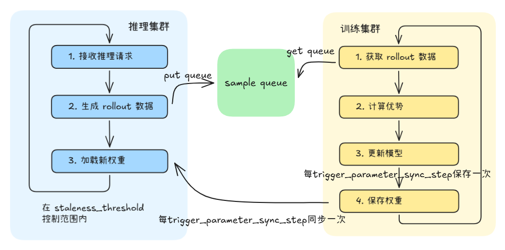

# 训推全异步分离模式使用指南（Fully Async 策略）

## 简介

训推全异步是 Agent SDK 提供的一种资源部署模式，在训推单步异步分离模式基础上进一步演进，通过 rollout 与 training 的完全解耦、流式数据传输、多步异步权重同步与新鲜度控制，实现 rollout 生成与 trainer 训练的时间重叠，显著缓解长尾样本带来的 NPU 空闲问题，提升整体训练吞吐。

### 模式与策略

Agent SDK 的训推分离采用两层设计：

- 部署模式：指训练和推理的资源部署方式，目前支持训推分离和训推共卡。
- 训练策略：指在分离模式下，训练如何利用推理产生的数据的异步策略，目前支持两种：
  - **One Step Off 策略**：训练始终使用上一轮推理产出的轨迹数据，保持一个迭代步的滞后。
  - **Fully Async 策略**：训练与推理完全解耦、并行执行，推理端以 prompt 组为粒度流式产出轨迹，训练端异步消费；通过新鲜度（staleness）控制与多步权重版本同步，实现无迭代步滞后的持续训练。

因此，当配置文件中将 `work_mode` 设置为 `fully_async` 时，表示同时选择了“训推分离部署模式”和“Fully Async 策略”。

### 运行过程

分离模式下，训练和推理在不同节点上并行执行：



- 推理集群持续接收推理请求，生成 rollout 轨迹数据，并以 **prompt 组**为粒度**流式写入 sample queue**；生成数量与队列积压受参数 `staleness_threshold` 与 `require_batches` 控制，超限时自动反压（暂停生成并趁机同步新权重）。
- 训练集群从 sample queue 异步拉取样本，计算优势并更新模型；每 `trigger_parameter_sync_step` 步发布一次新权重。
- 新权重保存到共享存储后，推理集群自动**探测并加载**新版本权重完成同步，同时将 staleness 计数重置为在途样本数。

### 适用场景

- 集群卡数充足，可以分别部署训练和推理集群。
- 希望训练与推理并行执行，最大化硬件利用率。
- 推理请求量大，需要独立的推理集群提供稳定服务。
- 数据存在明显长尾（部分轨迹生成时间远大于均值），需要训练与推理时间重叠以掩盖长尾等待。

> [!NOTE]
> 如果集群资源有限，希望训练和推理共享同一组卡，可参考[训推共卡模式使用指南](02_hybrid.md)。若希望训练与推理并行，但保持一个迭代步滞后，可参考[训推单步异步分离模式使用指南（One Step Off 策略）](03_one_step_off.md)。

### 与单步异步分离模式的区别

| 特性 | 单步异步分离模式（One Step Off） | 全异步分离模式（Fully Async）    |
|------|------------------------|-------------------------|
| 部署方式 | 训练和推理在不同节点上            | 训练和推理在不同节点上             |
| 执行方式 | 训练和推理并行，但保持一个迭代步滞后     | 训练和推理完全解耦并行，无迭代步滞后      |
| 数据交互 | 批次级（DataManager 攒批传输）  | 样本级流式（SampleQueue 逐组回写） |
| 权重同步 | 训练完直接同步到推理引擎           | 通过共享盘多版本异步同步，推理端主动探测加载  |
| 数据新鲜度控制 | 无（天然滞后一个迭代步）           | 通过 staleness 指标与反压机制控制  |
| 适用规模 | 大规模集群                  | 大规模集群，长尾明显场景            |
| 吞吐量 | 训练和推理并行，吞吐较高           | 训练与推理时间重叠，吞吐更高          |

## 工作原理

### 流式轨迹生成与反压控制

- **流式回写**：推理端对批次内各 prompt 并发生成轨迹，某个 prompt 的 n 条轨迹一旦齐备，立即格式化并携带权重版本号写入 `SampleQueue`，无须等待同批其他 prompt 完成——以 prompt 组为最小交付单元，缩短训练端首包等待时间。
- **反压控制**：推理端每交付一个 prompt 组即累加一次新鲜度计数（staleness）。当新鲜度计数或队列积压量任一达到 `max_required_samples` 上限时，暂停生成进入等待；等待期间轮询权重版本，发现新版本则顺带完成权重加载，待积压回落后恢复生成。
- **保新鲜兜底**：`SampleQueue` 容量已满时丢弃队首最旧（最低权重版本）样本并追加新样本，确保推理端生产不被阻塞。

### 异步训练消费与迭代控制

- **异步拉取**：训练端按 `require_batches` 设定的批次量从 `SampleQueue` 逐个取用样本，队列为空则阻塞等候，取足 `ppo_mini_batch_size × require_batches` 个样本后合并、对齐并更新参数，每消费一批即推进一次训练迭代。
- **迭代步控制**：训练端维护本地训练步计数，每推进一个本地步累加一次；计数达到 `trigger_parameter_sync_step` 时自增权重版本号并重置计数，随后将新权重落盘到共享存储，向推理端发布新版本。
- **陈旧度观测**：训练端统计本批样本的权重版本分布与陈旧占比（相对最新版本的过期样本数），量化 off-policy 程度，用于观测与调参。

### 权重版本同步与陈旧度管理

- **发布-探测模型**：训练端按 `trigger_parameter_sync_step` 节奏将权重落盘到共享存储（`iter_<N>` 目录）并通知推理端；推理端通过 `RolloutWeightManager` 维护“预测最高版本 / 已转换版本 / 已加载版本”三个状态，在每次生成前主动探测，训练端不直接推送。
- **同步触发条件**：仅当 staleness 达到 `max_required_samples` 且共享盘上存在高于本地已加载版本的权重时才触发加载；否则跳过以保留新旧数据重叠、避免频繁切换。
- **陈旧度重置**：加载新权重后，将 staleness 重置为当前在途（未消费）样本数；在途旧样本不作丢弃与改写，继续由训练端消费，此后新生成的样本方为最新权重产物。

### 关键参数说明

| 参数 | 位置 | 说明 |
|------|------|------|
| `staleness_threshold` | `verl_conf.async_training` | 新鲜度阈值（0~1），与 `require_batches`、`trigger_parameter_sync_step` 共同决定 `max_required_samples` |
| `trigger_parameter_sync_step` | `verl_conf.async_training` | 每隔多少训练迭代发布一次权重并推进权重版本号 |
| `require_batches` | `verl_conf.async_training` | 训练端单次从 SampleQueue 消费的批次数 |
| `max_required_samples` | 自动计算注入 | `= ppo_mini_batch_size × require_batches × (1 + staleness_threshold) × trigger_parameter_sync_step`，同时作为 SampleQueue 容量与反压阈值 |

## 使用方法

### 步骤 1：修改 hosts.conf

文件路径：`configs/hosts.conf`

分离模式下，推理节点排在前面，训练节点排在后面，且**不配置 `infer_master_index`**：

**双机分离部署**（1 台推理 + 1 台训练）：

```shell
# host,index,train_master_index,infer_master_index(可选)
<节点IP1>,0,0
<节点IP2>,1,1
```

| 参数 | 说明 |
|------|------|
| host | 节点 IP 地址 |
| index | 节点索引，从 0 开始。**推理节点索引必须小于训练节点索引** |
| train_master_index | 训练主节点标识，设为 1 表示该节点启动训练。**仅在训练节点上配置** |
| infer_master_index | 推理主节点标识。**分离模式下不配置此参数** |

> [!NOTE]
> 分离模式的关键标志是**不配置 `infer_master_index`**。系统根据 `VC_TASK_INDEX < MASTER_TRAIN_INDEX` 判定节点为推理节点，`VC_TASK_INDEX >= MASTER_TRAIN_INDEX` 判定为训练节点。推理节点必须排在训练节点前面（节点类型判断逻辑详见 [start_rl_with_verl_vllm.sh](../../../../aura/scripts/start_rl_with_verl_vllm.sh)，参数解析详见 [utils.sh](../../../../aura/scripts/base/utils.sh)）。

### 步骤 2：修改 base.conf

文件路径：`configs/base.conf`

```shell
# 工作模式设置为 fully_async
work_mode=fully_async

# 训练yaml文件
train_config_name=verl_train_fully_async_A3_t16_qwen3_32b_math_fsdp

# 推理yaml文件（分离模式必须配置）
infer_config_name=vllm_infer_i16_qwen3_32b
```

| 参数 | 说明 |
|------|------|
| work_mode | 设为 `fully_async` 表示全异步分离模式 |
| train_config_name | 训练 YAML 配置文件名（不含 .yaml 后缀） |
| infer_config_name | 推理 YAML 配置文件名（不含 .yaml 后缀），**分离模式必须配置** |

### 步骤 3：修改训练 YAML 配置文件

以 verl 后端、Qwen3-32B 模型为例，训练配置文件路径：`configs/train/verl_train_fully_async_A3_t16_qwen3_32b_math_fsdp.yaml`

需要根据实际环境修改以下参数：

#### 3.1 必须修改的路径参数

| 参数                                                  | 说明                                                           | 示例                                               |
|-----------------------------------------------------|--------------------------------------------------------------|--------------------------------------------------|
| `hydra.searchpath`                                  | verl 配置模板路径，改为本机 aura 代码仓中 `configs/train/verl_conf` 目录的绝对路径 | `file:///home/work/aura/configs/train/verl_conf` |
| `verl_conf.extras.data_loader.train_data_path`      | 训练数据集路径（bin/idx 格式，不含文件后缀）                                   | `/data/train/rl`                                 |
| `verl_conf.actor_rollout_ref.model.path`            | 模型权重路径                                                       | `/data/weights/qwen3-32b`                        |
| `train_instances.rollout_config.llm_tokenizer_path` | 分词器路径（与模型路径一致）                                               | `/data/weights/qwen3-32b`                        |

#### 3.2 全异步分离模式（Fully Async策略）关键配置项

以下配置项是保证全异步部署与策略正确运行的核心参数（以 Qwen3-32B 模型为例，实际请根据模型规格调整）。

**train_instances 中 work_mode 必须为 fully_async：**

```yaml
train_instances:
  - name: RL-QWEN3-32B-WITH-MATH
    executor_kwargs:
      work_mode: fully_async    # 必须设为 fully_async
      train_engine: verl
```

**rollout_config 中 use_on_policy 必须为 false：**

```yaml
train_instances:
  - name: RL-QWEN3-32B-WITH-MATH
    executor_kwargs:
      rollout_config:
        use_on_policy: false    # 全异步模式必须设为 false，保证 Off-Policy 策略
```

> [!NOTE]
> `use_on_policy` 控制训练是否使用当前最新策略生成的轨迹数据。全异步模式下必须设为 `false`。

**hybrid_engine 必须关闭：**

```yaml
verl_conf:
  actor_rollout_ref:
    hybrid_engine: False    # 分离模式必须关闭
```

**训练并行度配置：**

```yaml
verl_conf:
  actor_rollout_ref:
    rollout:
      tensor_model_parallel_size: 4    # 训练张量并行大小
      data_parallel_size: 4            # 训练数据并行大小
  trainer:
    n_gpus_per_node: 16               # 每节点卡数
    nnodes: 1                         # 训练节点数
```

**异步训练配置（全异步模式核心参数）：**

```yaml
verl_conf:
  async_training:
    use_rollout_log_probs: True
    staleness_threshold: 0.5              # 新鲜度阈值
    trigger_parameter_sync_step: 4        # 每隔多少 iter 同步一次权重
    require_batches: 4                    # 单次从 SampleQueue 消费的批次数
    partial_rollout: False
```

**异步训练推荐配置：**

| 序号 | staleness_threshold | trigger_parameter_sync_step | require_batches | 特点与适用场景 |
|------|------|------|------|------|
| 1 | 0.5 | 2 | 4 | **高频同步 + 高新鲜度**：每 2 个 iter 发布一次权重，off-policy 程度最低，数据最贴近当前策略；同步开销较高，适合对数据新鲜度敏感、推理端生成稳定、可接受频繁同步换权的场景 |
| 2 | 0.75 | 2 | 4 | **高频同步 + 宽松陈旧容忍**：保持频繁同步的同时放大缓冲，能吸收推理端短期生成波动；适合生成速度存在小幅抖动、又不希望 off-policy 过高的场景 |
| 3 | 0.5 | 4 | 4 | **均衡型（当前示例配置）**：同步频率与新鲜度适中，缓冲较大、反压不易触发；适合训练与推理节奏较为宽松的一般大规模场景 |
| 4 | 0.75 | 4 | 4 | **稀疏同步 + 高陈旧容忍**：同步开销最低、缓冲最大，最大化训练推理时间重叠；适合长尾明显、推理端抖动大、对 off-policy 不敏感的场景 |

**参数调节方向**：

- `trigger_parameter_sync_step` 越大，权重同步越稀疏、同步开销越低，但训练端与推理端权重版本差距越大。
- `staleness_threshold` 越大，允许的陈旧样本越多、缓冲（`max_required_samples`）越大、反压越难触发，但 off-policy 程度越高。
- 一般先固定 `require_batches`（训练端消费节奏），再根据"同步开销 vs 数据新鲜度"的权衡调节 `trigger_parameter_sync_step` 与 `staleness_threshold`。

> [!NOTE]
> `max_required_samples` 无需手动配置。启动时由 [fully_async/train_main.py](../../../../aura/aura/trainer/train_adapter/verl/fully_async/train_main.py) 自动计算（`= ppo_mini_batch_size × require_batches × (1 + staleness_threshold) × trigger_parameter_sync_step`），并注入 rollout 配置与 SampleQueue 容量。上述示例计算结果为 `4 × 4 × 1.5 × 4 = 96`。

**推理引擎配置（infer_instances）：**

分离模式下，`infer_instances` 中的以下参数无需手动配置，启动脚本会自动从推理集群获取并替换（[替换逻辑详见 start_verl_train_cluster.sh](../../../../aura/scripts/train/start_verl_train_cluster.sh)）：

- `chat_server`：推理服务地址（由启动脚本用推理主节点 IP 拼接）
- `prefill_server_list`：Prefill 实例地址列表（由启动脚本根据推理节点 IP 自动计算）
- `decode_server_list`：Decode 实例地址列表（由启动脚本根据推理节点 IP 自动计算）
- `tensor_parallel_size`：推理张量并行大小（来自推理 YAML）
- `data_parallel_size`：推理数据并行大小（来自推理 YAML）
- `enable_expert_parallel`：是否开启专家并行（来自推理 YAML）

> [!NOTE]
> 此自动替换机制依赖**共享文件系统**：推理集群将配置写入共享存储的临时文件，训练主节点读取后通过 sed 替换训练 YAML，其他训练节点通过共享文件系统读取修改后的配置。仅训练主节点执行替换操作，避免多节点并发修改冲突。

配置时填入默认值即可：

```yaml
infer_instances:
  - name: Qwen3-32B
    executor_kwargs:
      engine: vllm_proxy
      engine_kwargs:
        chat_server: "http://0.0.0.0:8080"           # 默认即可，启动脚本会自动修改
        prefill_server_list: ["http://0.0.0.0:20012"]  # 默认即可，启动脚本会自动修改
        decode_server_list: []                          # 默认即可，启动脚本会自动修改
        model_name: Qwen3-32B
        tensor_parallel_size: 4                         # 默认即可，启动脚本会自动修改
        data_parallel_size: 4                           # 默认即可，启动脚本会自动修改
        enable_expert_parallel: false                   # 默认即可，启动脚本会自动修改
```

### 步骤 4：修改推理 YAML 配置文件

分离模式需要单独配置推理 YAML 文件，路径：`configs/infer/vllm_infer_i16_qwen3_32b.yaml`

#### 4.1 必须修改的路径参数

| 参数 | 说明 | 示例 |
|------|------|------|
| `infer_model_path` | 模型权重路径 | `/data/weights/qwen3-32b` |

#### 4.2 推理关键配置项

```yaml
# 模型名称
infer_model_name: Qwen3-32B

# 推理并行度
tensor_parallel_size: 4
data_parallel_size: 4

# 模型输出最大长度
max_model_len: 32768

# 推理显存占用比例
gpu_memory_utilization: 0.6
```

| 参数 | 说明 |
|------|------|
| `tensor_parallel_size` | 推理张量并行大小 |
| `data_parallel_size` | 推理数据并行大小 |
| `max_model_len` | 模型输出最大长度 |
| `gpu_memory_utilization` | 推理显存占用比例 |

#### 4.3 卡资源分配说明

分离模式下，训练集群和推理集群各自独占卡资源，互不干扰：

- **训练集群卡数** = `n_gpus_per_node` × `nnodes`（训练节点数）
- **推理集群卡数** = `tensor_parallel_size` × `data_parallel_size`

推理集群的节点分配由启动脚本根据推理 YAML 中的并行度参数自动计算。每个推理实例所需卡数为 `tensor_parallel_size × data_parallel_size`，所需节点数为 `卡数 / 每节点卡数`。

例如：`tensor_parallel_size=4, data_parallel_size=4`，则推理需要 16 卡，在 A3 机器（16 卡/节点）上需要 1 个节点。

### 步骤 5：启动训练

```bash
cd /home/work/AgentSDK/aura
bash scripts/start_rl_with_verl_vllm.sh
```

启动后，系统将根据 `hosts.conf` 自动识别各节点角色：

- 推理节点启动 vLLM 推理集群
- 训练节点等待推理集群就绪后，启动训练进程

## 源码实现原理

全异步模式的核心源码调用链路如下：

### 启动流程

1. **入口脚本** [start_rl_with_verl_vllm.sh](../../../../aura/scripts/start_rl_with_verl_vllm.sh)：`get_node_type()` 根据 `VC_TASK_INDEX` 和 `MASTER_TRAIN_INDEX` 判定节点为 `infer` 或 `train` 类型，分别启动推理和训练进程
2. **推理集群启动** [start_vllm_infer_cluster.sh](../../../../aura/scripts/infer/start_vllm_infer_cluster.sh)：解析推理配置，启动 vLLM 推理服务，将服务地址写入共享存储
3. **推理配置解析** [parse_infer_config.sh](../../../../aura/scripts/infer/vllm/parse_infer_config.sh)：从推理 YAML 读取并行度参数，自动分配节点 IP，写入 `conf_for_train/` 临时文件
4. **训练集群启动** [start_verl_train_cluster.sh](../../../../aura/scripts/train/start_verl_train_cluster.sh)：等待推理集群就绪，读取临时文件替换训练 YAML 中的推理配置，启动训练
5. **任务路由** [train_register.py](../../../../aura/aura/trainer/trainer_register/train_register.py)：根据 `train_engine=verl` 和 `work_mode=fully_async` 注册并路由到 `verl_fully_async_train`
6. **全异步入口** [fully_async/train_main.py](../../../../aura/aura/trainer/train_adapter/verl/fully_async/train_main.py)：计算 `required_samples`/`max_required_samples`，创建 `SampleQueue`，将 `max_required_samples` 注入 rollout 配置，异步启动 `start_fully_async_rollout` 与训练

### 训练核心链路

| 组件 | 源码位置 | 说明 |
|------|---------|------|
| 任务入口 | [fully_async/train_main.py](../../../../aura/aura/trainer/train_adapter/verl/fully_async/train_main.py) | `start_train`：计算样本上下限、创建 SampleQueue、异步启动全异步 rollout 与训练 |
| 训练器 | [full_async/full_async_trainer.py](../../../../aura/aura/trainer/train_adapter/verl/full_async/full_async_trainer.py) | `FullyAsyncTrainer` 继承 verl 的 `SeparateRayPPOTrainer`，异步消费 SampleQueue、推进训练迭代、按步数发布权重版本 |
| 样本队列 | [sample_queue.py](../../../../aura/aura/controllers/rollout_controller/sample_queue.py) | `SampleQueue`：推理端流式写入、训练端异步拉取，容量满时丢弃最旧样本 |
| 训练控制器 | [train_controller.py](../../../../aura/aura/controllers/train_controller/train_controller.py) | `TrainController` 管理训练数据分发、rollout 调度和权重版本发布 |
| 数据管理 | [data_manager.py](../../../../aura/aura/data_manager/data_manager.py) | `DataManager` 管理训练数据的加载和分发 |

### 推理核心链路

| 组件 | 源码位置 | 说明 |
|------|---------|------|
| Rollout 服务 | [rollout_service.py](../../../../aura/aura/trainer/rollout/rollout_service.py) | `start_fully_async_rollout` 启动全异步 rollout 进程，注入 SampleQueue 与 `max_required_samples` |
| 执行器 | [fully_async_rollout_executor.py](../../../../aura/aura/trainer/rollout/fully_async_rollout_executor.py) | `FullyAsyncRolloutExecutor` 主循环：弹出批次、合并、注入 data manager、触发生成 |
| 工作单元 | [rollout_worker.py](../../../../aura/aura/trainer/rollout/rollout_worker.py) | 流式轨迹生成、反压控制、权重版本探测与加载 |
| 权重同步 | [rollout_weight_manager.py](../../../../aura/aura/controllers/rollout_controller/rollout_weight_manager.py) | `RolloutWeightManager` 权重版本管理与训练权重的异步同步更新 |
| 推理服务管理 | [async_server.py](../../../../aura/aura/runner/infer_adapter/async_server.py) | `AsyncServerManager` 管理分离模式下的推理引擎实例 |

### 配置自动替换机制

分离模式下，训练 YAML 中的推理配置由启动脚本自动替换，流程如下：

1. 推理集群启动时，[write_infer_server_list()](../../../../aura/scripts/infer/vllm/parse_infer_config.sh) 和 [write_infer_parallel_size()](../../../../aura/scripts/infer/vllm/parse_infer_config.sh) 将服务地址和并行度写入共享存储的临时文件
2. 训练集群启动时，[get_infer_server_config()](../../../../aura/scripts/train/start_verl_train_cluster.sh) 读取临时文件
3. [replace_infer_server_config()](../../../../aura/scripts/train/start_verl_train_cluster.sh) 用 sed 替换训练 YAML 中的 `chat_server`、`prefill_server_list`、`decode_server_list`、`tensor_parallel_size`、`data_parallel_size`、`enable_expert_parallel`（仅训练主节点执行替换，依赖共享文件系统）

## 常见问题

### Q1：全异步模式下推理集群启动失败怎么办

检查以下几点：

1. 推理 YAML 中的 `infer_model_path` 是否正确指向模型权重路径
2. 推理节点的卡数是否满足 `tensor_parallel_size × data_parallel_size` 的要求
3. 推理节点是否可以访问共享存储（权重文件路径）

### Q2：如何确认系统正确识别为全异步模式

启动日志中会打印以下信息：

```text
[INFO] NODE_TYPE: infer    # 推理节点
[INFO] NODE_TYPE: train    # 训练节点
[INFO] work_mode: fully_async
```

如果节点类型显示不正确，请检查 `hosts.conf` 和 `base.conf` 是否配置正确。

### Q3：训练集群等待推理集群就绪超时怎么办

分离模式下训练集群会等待推理集群启动完成后才开始训练。如果推理集群启动较慢，训练日志中会持续打印：

```text
[WARN] external vllm cluster is not ready, waiting 5 seconds...
```

这是正常现象，等待推理集群就绪后会自动继续。如果长时间无法就绪，请检查推理集群的启动日志。

### Q4：如何确认反压与权重同步在生效

推理端日志会打印 staleness 与队列状态。当反压触发时出现：

```text
[async-rollout] backpressure triggered: staleness=.../96, queue_size=.../96, current_weight_version=...
```

当权重同步发生时出现：

```text
[async-rollout] weights reloaded: new_version=..., staleness_reset_to=...
```
