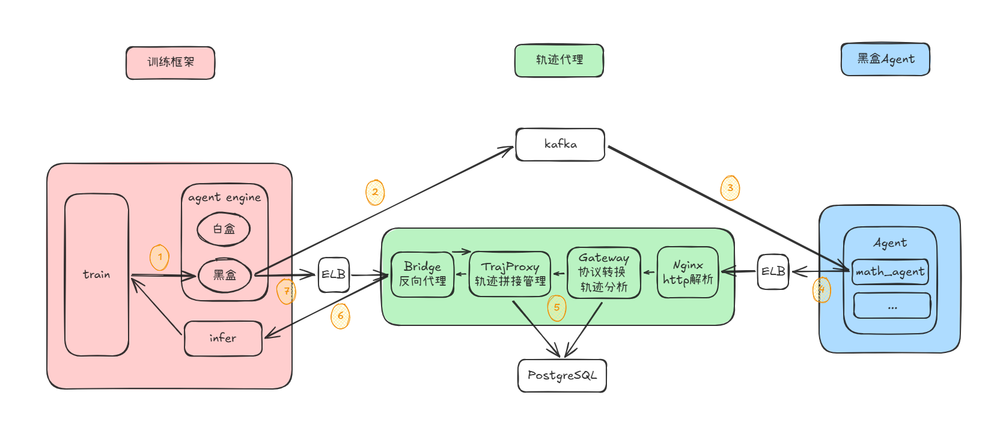

# 黑盒 Agent 接入指南

## 简介

黑盒 Agent 模式允许用户将**外部独立的 Agent 服务**接入 Aura 训练框架，参与强化学习（GRPO 等）训练循环。在该模式下，训练框架将 Agent 视为一个"黑盒"——只通过 HTTP 协议发送 prompt 并等待结果，不关心 Agent 内部的具体实现逻辑。

### 适用场景

| 场景 | 说明 |
|------|------|
| **已有 Agent 系统** | 你已有成熟的 Agent 服务（如基于 LangChain、CrewAI 等框架），希望将其接入 RL 训练 |
| **多轮 tool calling** | Agent 需要多次调用工具（如 Python 执行、搜索等）才能完成任务 |
| **异构环境** | Agent 运行在不同的语言、框架或运行时环境中，无法直接在训练框架内执行 |

### 核心概念

| 组件 | 说明 |
|------|------|
| **VAEE** (VirtualAgentEngineExecutionWrapper) | 训练框架侧的"虚拟引擎"，负责通过 HTTP 与外部 Agent 通信，并处理轨迹与奖励 |
| **AgentProxyClient** | 向外部 Agent 服务发送 prompt 的 HTTP 客户端 |
| **TrajProxy** | 轨迹代理服务，转发 Agent 的 LLM 推理请求并记录轨迹 |
| **TrajProxyClient** | 从 TrajProxy 拉取轨迹记录的 HTTP 客户端 |
| **外部 Agent 服务** | 用户自行实现的 Agent 服务，接收 prompt，执行 agent loop，返回结果 |
| **traj_refine_func** | 轨迹聚合函数，将 TrajProxy 记录的原始请求/响应聚合为层级化轨迹（Episode） |
| **res_reward_func** | 步骤级奖励函数，为轨迹中的每一步计算中间奖励 |

### 架构总览



## 快速开始

### 步骤一：部署 轨迹代理 服务

#### 运行流程

使用第三方库[TrajProxy](https://github.com/infzo/TrajProxy)启动轨迹代码服务，端口为 `12300`（默认）。

1. 启动 Aura 容器环境（不需要挂 NPU 卡），用于运行 TrajProxy 服务。

    第一步：拉取预构建镜像（本文档以 Atlas A3 服务器 16 卡、Ubuntu 系统为例进行说明）：

    ```shell
    docker pull swr.cn-south-1.myhuaweicloud.com/ascendhub/agentsdk:26.1.0-cann9.0.0-torch_npu2.9.0-a3-ubuntu22.04-py3.11
    ```

    第二步：创建容器：

    ```shell
    docker run --name your_container_name \
        --hostname agent \
        --network host \
        -it -d --shm-size=500g \
        --device=/dev/davinci_manager \
        --device=/dev/hisi_hdc \
        --device=/dev/devmm_svm \
        -v /usr/local/Ascend/driver:/usr/local/Ascend/driver \
        -v /usr/local/dcmi:/usr/local/dcmi \
        -v /usr/local/bin/npu-smi:/usr/local/bin/npu-smi \
        -v /etc/ascend_install.info:/etc/ascend_install.info \
        -v /usr/share/zoneinfo/Asia/Shanghai:/etc/localtime \
        -v /usr/local/sbin:/usr/local/sbin \
        swr.cn-south-1.myhuaweicloud.com/ascendhub/agentsdk:26.1.0-cann9.0.0-torch_npu2.9.0-a3-ubuntu22.04-py3.11  \
        sleep infinity
    ```

    第三步：进入容器环境

    ```shell
    docker exec -it your_container_name bash
    ```

2. 下载代码：

    ```shell
    cd /home/work/AgentSDK/aura/traj_proxy
    bash download_traj_proxy.sh
    ```

    TrajProxy 代码位于 `app` 目录下，将 `app/dockers/allinone/configs/config.yaml` 中的 `model_name` 改为 `Qwen3-8B`，并将 `tokenizer_path` 修改为 `Qwen3-8B` 对应的模型路径。

3. 安装依赖：

    ```shell
    bash traj_proxy_install.sh
    ```

4. 初始化服务：

    ```shell
    bash traj_proxy_init.sh
    ```

5. 启动服务：

    ```shell
    bash traj_proxy_start.sh
    ```

    服务成功启动后的预期日志：

    ```log
    (RemoteWorker pid=24896) INFO:     Started server process [24896]
    (RemoteWorker pid=24896) INFO:     Waiting for application startup.
    (RemoteWorker pid=24896) INFO:     Application startup complete.
    (RemoteWorker pid=24896) INFO:     Uvicorn running on http://0.0.0.0:12301 (Press CTRL+C to quit)
    ```

6. 发送请求到 TrajProxy 验证服务：

    ```shell
    curl -s http://0.0.0.0:12300/models | python3 -m json.tool
    curl http://0.0.0.0:12300/health
    ```

    日志显示如下即表示 TrajProxy 服务的请求接收正常：

    ```log
    # curl -s http://0.0.0.0:12300/models | python3 -m json.tool
    {
        "status": "success",
        "count": 3,
        "models": [
            {
                "run_id": "app-001",
                "model_name": "Qwen3-8B",
                "tokenizer_path": "/path/to/models/Qwen3-8B",
                "token_in_token_out": true,
                "infer_client_url": "http://host.docker.internal:8000/v1"
            },
            {
                "run_id": "app_math_blackbox",
                "model_name": "/path/to/models/Qwen3-8B",
                "tokenizer_path": null,
                "token_in_token_out": false,
                "infer_client_url": "http://0.0.0.0:8080/v1"
            },
            {
                "run_id": "DEFAULT",
                "model_name": "Qwen3-8B",
                "tokenizer_path": null,
                "token_in_token_out": false,
                "infer_client_url": "http://host.docker.internal:8000/v1"
            }
        ]
    }

    # curl http://0.0.0.0:12300/health
    {"status":"ok"}
    ```

### 步骤二：部署 Agent 服务

#### 黑盒 Agent 接入训练关键约束

外部 Agent 服务需要实现一个 HTTP 接口 `POST /v1/chat/completions`，接收训练框架发来的 prompt，在内部执行完整的 agent loop（多轮 tool calling），完成后返回 HTTP 200。

**请求格式**：

```json
{
  "model": "Qwen3-8B",
  "messages": [
    {"role": "system", "content": "You are a math assistant..."},
    {"role": "user", "content": "Solve: 1+2+...+100 = ?"}
  ],
  "infer_params": {
    "temperature": 1.0,
    "top_p": 1.0,
    "max_tokens": 8192,
    "model": "/path/to/model"
  },
  "extra_params": {},
  "infer_url": "http://0.0.0.0:12300/s/app_math_blackbox/xxx,v1/"
}
```

**核心约束**：Agent 在 agent loop 中的每一步 LLM 调用，**必须将请求发送到 `infer_url`**（即 TrajProxy），而非直接调用 vLLM。这样 TrajProxy 才能记录每步推理的请求/响应，并转发请求至 Agent SDK 推理端，供训练框架后续拉取轨迹。

#### 运行流程

1. 黑盒 Agent 接入约束：需要适配接口`POST /v1/chat/completions`，由 AgentProxyClient 调用。

2. 使用 FastAPI 启动 Agent 服务，端口为 `28124`（默认，若自定义端口请同步修改配置文件[共卡训练配置文件](../../../../aura/configs/train/verl_train_hybrid_A3_t16_qwen3_8b_blackbox_math_fsdp.yaml)）中的 `agent_proxy_args.agent_addr` 配置。

    ```shell
    uvicorn path.to.math_agent.server:app --host 0.0.0.0 --port 28124
    ```

3. 发送请求到 Agent 验证服务：

    ```shell
    curl http://0.0.0.0:28124/health
    ```

    日志显示如下即表示 Agent 服务的请求接收正常：

    ```log
    # curl http://0.0.0.0:28124/health
    {"status":"ok"}
    ```

### （可选）步骤：实现轨迹聚合函数

自定义轨迹聚合函数（ttraj_refine_func），负责将从 TrajProxy 拉取的原始请求/响应记录（`List[RequestRecord]`）聚合为层级化轨迹（`Episode`）。如果场景与默认行为一致，可以跳过此步骤。

> [!NOTE]
> 完整实现可参考内置轨迹聚合函数：[ozy_token_traj_refine_func](../../../../aura/agents/proxy_agent/math/ozy_traj_refine_reward.py)
> 自定义函数实现后需要同步修改训练配置 [共卡训练配置文件](../../../../aura/configs/train/verl_train_hybrid_A3_t16_qwen3_8b_blackbox_math_fsdp.yaml) 中 `traj_refine_func` 为 对应函数路径

### （可选）步骤：实现奖励函数（可选）

自定义轨迹级奖励函数（res_reward_func），为整个轨迹计算最终奖励。

> [!NOTE]
> 完整实现可参考内置轨迹聚合函数：[math_res_reward_fn](../../../../aura/agents/proxy_agent/math/ozy_math_reward.py)
> 自定义函数实现后需要同步修改训练配置 [verl_train_hybrid_A3_t16_qwen3_8b_blackbox_math_fsdp.yaml](../../../../aura/configs/train/verl_train_hybrid_A3_t16_qwen3_8b_blackbox_math_fsdp.yaml) 中 `res_reward_func` 为 对应函数路径

### 步骤三：启动训练

参考[Qwen3-8B快速入门指南](../../../../docs/zh/aura/models/qwen3_8b.md)，将配置文件修改为**支持黑盒 Agent 接入**的[共卡训练配置文件](../../../../aura/configs/train/verl_train_hybrid_A3_t16_qwen3_8b_blackbox_math_fsdp.yaml)，启动共卡模式训练。

## 源码实现原理

| 组件 | 源码位置 | 说明 |
|------|---------|------|
| VAEE Wrapper | [vaee_engine_wrapper.py](../../../../aura/aura/runner/agent_engine_wrapper/vaee/vaee_engine_wrapper.py) | 虚拟引擎，封装黑盒通信流程 |
| AgentProxyClient | [agent_proxy_client.py](../../../../aura/aura/runner/agent_engine_wrapper/proxy_client/agent_proxy_client.py) | 向外部 Agent 发送 prompt 的 HTTP 客户端 |
| TrajProxyClient | [traj_proxy_client.py](../../../../aura/aura/runner/agent_engine_wrapper/proxy_client/traj_proxy_client.py) | 从 TrajProxy 拉取轨迹的 HTTP 客户端 |
| 默认轨迹聚合 | [default_traj_refine.py](../../../../aura/aura/runner/agent_engine_wrapper/vaee/default_traj_refine.py) | 默认的轨迹聚合函数（step 模式和 token 模式） |
| 默认轨迹奖励 | [default_traj_reward.py](../../../../aura/aura/runner/agent_engine_wrapper/vaee/default_traj_reward.py) | 默认的轨迹级奖励函数 |
| 类型定义 | [vaee_types.py](../../../../aura/aura/runner/agent_engine_wrapper/vaee/vaee_types.py) | RequestRecord / Step / Trajectory / Episode 等核心类型 |

## 与白盒 Agent 对比

| 维度 | 白盒 Agent (rllm) | 黑盒 Agent (vaee) |
|------|-------------------|-------------------|
| Agent 运行位置 | 训练框架内 | 外部独立服务 |
| 通信方式 | 进程内调用 | HTTP |
| 自定义 Agent | 实现 BaseAgent + BaseEnv | 实现外部 HTTP 服务 |
| LLM 调用 | 框架自动处理 | 用户管理，需走 infer_url |
| 轨迹记录 | 框架自动记录 | 通过 TrajProxy 转发记录 |
| 适用场景 | 简单 agent loop | 复杂/异构 agent 系统 |

## FAQ

**Q1：外部 Agent 服务必须用 Python 实现吗**

不需要。只要暴露 `POST /v1/chat/completions` 接口即可，可以使用任何语言或框架。唯一要求是 agent loop 中的 LLM 调用必须走 `infer_url`（TrajProxy）。

**Q2：traj_refine_func 和 res_reward_func 是否必须实现**

不必须。如果不配置，框架会使用默认的 `default_token_traj_refine_func` 和 `default_traj_reward_func`。仅当默认行为不满足场景需求时才需要自定义。

**Q3：外部 Agent 服务需要处理哪些异常情况**

Agent 服务内部异常应在服务侧自行处理，并确保返回 HTTP 200（避免训练框架重试）。如果 agent loop 执行失败，可以在返回体中携带错误信息，训练框架侧通过 `error_traceback` 字段过滤异常轨迹。

**Q4：多条轨迹与 session_id 的关系**

每次 `POST /v1/chat/completions` 请求对应一个 `session_id`，一个 session 内的所有 LLM 调用通过 `infer_url` 中的 session_id 关联。TrajProxy 按 session_id 分组存储轨迹记录，训练框架通过 `GET /trajectory?session_id=xxx` 拉取完整轨迹。

**Q5：部署过程中出现通信问题，显示网络无法连通。**

请确认各服务是否配置了网络代理，单机部署不需要访问外部网络，删除网络代理配置。

```shell
unset http_proxy https_proxy HTTP_PROXY HTTPS_PROXY all_proxy ALL_PROXY
```
